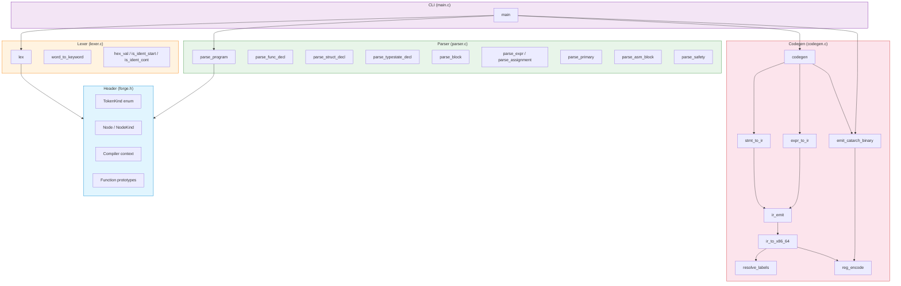
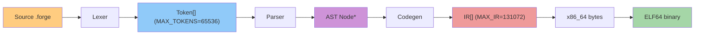
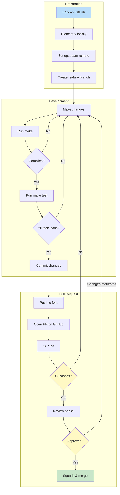
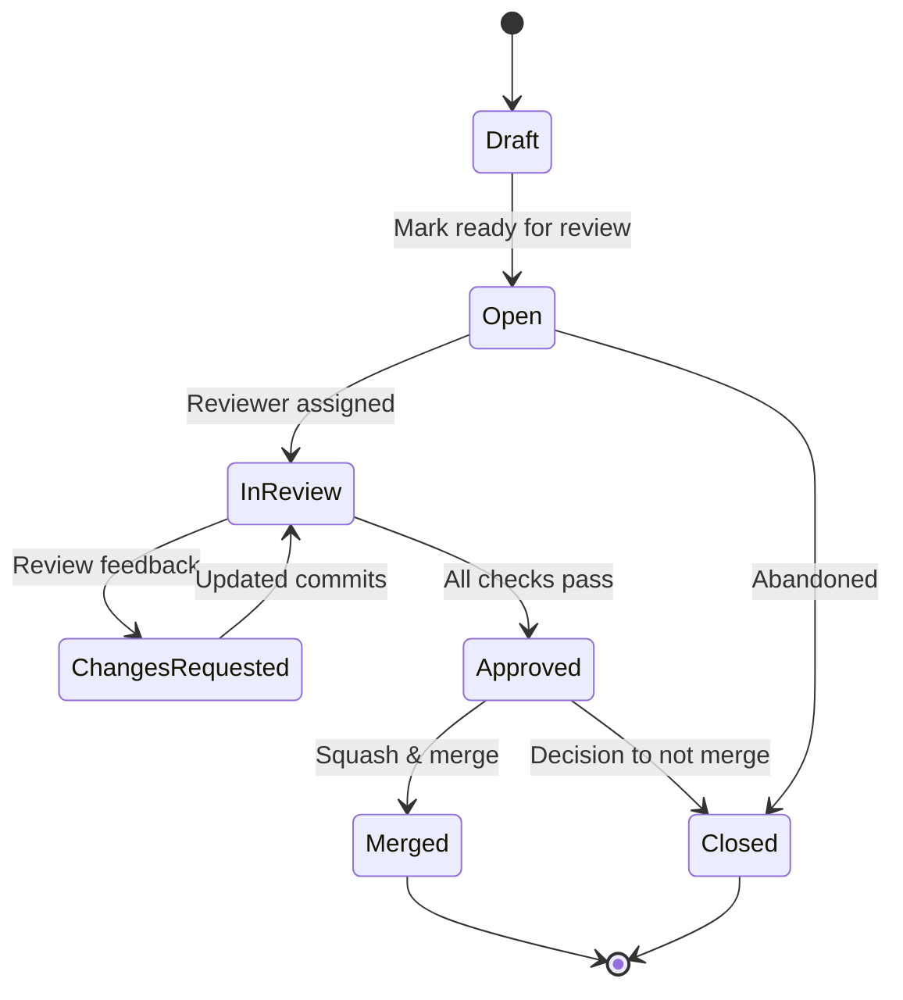
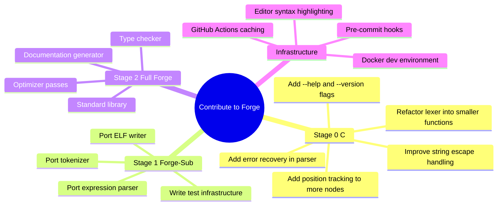

┌────────────────────────────────────────────────────────────────────────────┐
│                              CONTRIBUTING                                   │
│                      Forge Programming Language                              │
│              Self-hosting systems language · x86_64 · ELF64                 │
└────────────────────────────────────────────────────────────────────────────┘

[](https://github.com/c4x64/forge/actions)
[](https://opensource.org/licenses/MIT)
[](CONTRIBUTING.md)
[-orange.svg)](forge/stage0/)
[](forge/stage0/)
[](README.md)

> **Welcome, contributor!** Forge is a self-hosting systems language combining
> assembly power with Python-like syntax and formal safety annotations. This
> guide covers everything you need to contribute effectively — from setting up
> your environment to understanding the compiler internals.

---

<h2>📖 Table of Contents</h2>

1. [Code of Conduct](#-code-of-conduct)
2. [Quick Start](#-quick-start)
3. [Project Structure](#-project-structure)
4. [Development Workflow](#-development-workflow)
5. [Coding Conventions](#-coding-conventions)
6. [Pull Request Process](#-pull-request-process)
7. [Architecture Overview](#-architecture-overview)
8. [Stage 0 Internals](#-stage-0-internals-deep-dive)
9. [Testing Guide](#-testing-guide)
10. [Stage 1 & Stage 2 Plans](#-stage-1--stage-2-plans)
11. [Getting Help](#-getting-help)
12. [License](#-license)

---

<h2>📜 Code of Conduct</h2>

This project adheres to the [Contributor Covenant](https://www.contributor-covenant.org/version/2/1/code_of_conduct/) v2.1.
By participating, you agree to uphold a harassment-free, inclusive environment
for everyone. Report violations to the maintainers.

---

<h2>⚡ Quick Start</h2>

```bash
# Clone the repository
git clone https://github.com/c4x64/forge.git
cd forge

# Build the Stage 0 bootstrap compiler
cd forge/stage0 && make

# Verify the build
ls -la forge
# → should print: forge (the compiler binary)

# Compile all examples
make test

# Or test individual programs:
./forge ../examples/exit.forge -o /tmp/exit_test && /tmp/exit_test ; echo $?
# → 0

./forge ../examples/hello.forge -o /tmp/hello_test && /tmp/hello_test
# → Hello, Forge!

./forge ../examples/fib.forge -o /tmp/fib_test && /tmp/fib_test ; echo $?
# → 0
```

**Prerequisites:**
- A C99 compiler (<kbd>gcc</kbd> ≥ 11 or <kbd>clang</kbd>)
- <kbd>make</kbd> ≥ 4.0
- POSIX environment (Linux recommended; macOS with Xcode CLT works)
- **Zero** external dependencies — the compiler has no runtime, no VM, no linker dependency

---

<h2>📁 Project Structure</h2>

```
forge/
├── assets/                   # Branding assets (logo, etc.)
│   └── logo.png
├── forge/                    # Language implementation
│   ├── examples/             # Example Forge programs (used as test suite)
│   │   ├── exit.forge        # Minimal exit(0) — hello world of syscalls
│   │   ├── hello.forge       # Hello World with string data
│   │   └── fib.forge         # Recursive Fibonacci via asm blocks
│   ├── lib/                  # Standard library (empty in Stage 0)
│   └── stage0/               # Bootstrap compiler in C
│       ├── forge.h           # Core definitions: TokenKind, Node (AST), Compiler context
│       ├── lexer.c           # Tokenizer with indentation tracking (353 lines)
│       ├── parser.c          # Recursive descent parser for Forge-Sub (774 lines)
│       ├── codegen.c         # IR emission, x86_64 codegen, ELF64 writer (721 lines)
│       ├── main.c            # Pipeline orchestration, file I/O, CLI (96 lines)
│       └── Makefile          # Build system (gcc, -std=gnu99, -Wall -Wextra -O2 -g)
├── .github/
│   ├── workflows/
│   │   └── ci.yml            # GitHub Actions: build + test + ELF verification
│   └── ISSUE_TEMPLATE/
│       ├── bug_report.md     # Bug report issue template
│       └── feature_request.md # Feature request issue template
├── cat.toml                  # Project metadata (version, authors, stages, profiles)
├── CHANGELOG.md              # Release history
├── CONTRIBUTING.md           # ← You are here
├── LICENSE                   # MIT License
└── README.md                 # Project overview
```

<details>
<summary><strong>🔍 Click to expand: Component dependency diagram</strong></summary>



</details>

<details>
<summary><strong>🔍 Click to expand: Data flow through the compiler pipeline</strong></summary>



</details>

---

<h2>🔄 Development Workflow</h2>



### 🧪 Branch naming convention

| Branch pattern | Purpose | Example |
|:---|:---|:---|
| `feat/*` | New features | `feat/string-interpolation` |
| `fix/*` | Bug fixes | `fix/lexer-hex-parsing` |
| `refactor/*` | Code restructuring | `refactor/ir-pipeline` |
| `docs/*` | Documentation | `docs/contributing-guide` |
| `test/*` | Test additions | `test/edge-case-comments` |
| `ci/*` | CI/CD changes | `ci/macos-runner` |

### 💬 Commit message style

Use imperative mood with conventional-commits formatting:

```
type(scope): short description (≤72 chars)

Optional body with details. Reference issues with #N.
```

| Type | When to use |
|:---|:---|
| `feat` | A new language feature or compiler capability |
| `fix` | A bug fix in any stage |
| `refactor` | Code change with no functional impact |
| `docs` | Documentation-only changes |
| `test` | Adding or fixing tests |
| `chore` | Build, CI, tooling |

**Examples from the codebase:**[^1]

```
feat(codegen): add RIP-relative LEA for data labels
fix(lexer): handle nested comment edge case
docs(contributing): add architecture overview
test(examples): add exit.forge minimal example
```

> <kbd>git commit -m "feat(parser): add typestate declaration parsing"</kbd>

[^1]: See `CHANGELOG.md` for the full release history matching these conventions.

---

<h2>📐 Coding Conventions</h2>

### 🎯 General rules

┌─────────────────────────────────────────────────────────────────────────────┐
│  🔹 4-space indentation, no tabs                                             │
│  🔹 No trailing whitespace                                                   │
│  🔹 Files must end with a single newline                                     │
│  🔹 `snake_case` for functions, variables, types, enums, structs             │
│  🔹 `SCREAMING_SNAKE_CASE` for macros and compile-time constants             │
│  🔹 Zero compiler warnings (flags: `-Wall -Wextra`)                          │
│  🔹 Zero instances of undefined behavior                                     │
│  🔹 Braces on the same line (K&R style) for control flow                     │
└─────────────────────────────────────────────────────────────────────────────┘

### 🏗️ Stage 0 (C) conventions

| Aspect | Convention | Example from codebase |
|:---|---:|:---|
| **C standard** | C99 / GNU99 | `-std=gnu99` in `Makefile:2` |
| **Compiler** | gcc or clang | `CC = gcc` in `Makefile:1` |
| **Optimization** | `-O2` for release, `-g` always | `Makefile:2` |
| **Warnings** | `-Wall -Wextra` minimum | `Makefile:2` |
| **Indentation** | 4 spaces, no tabs | Throughout `lexer.c`, `parser.c` |
| **Function naming** | `snake_case` | `parse_func_decl`, `expr_to_ir`, `emit_catarch_binary` |
| **Type naming** | `PascalCase` (enum/struct tags) | `TokenKind`, `NodeKind`, `IROp`, `Compiler` |
| **Enum values** | `UPPER_SNAKE_CASE` | `T_EOF`, `N_PROGRAM`, `IR_ADD`, `D_LPAREN` |
| **Macros** | `UPPER_SNAKE_CASE` | `MAX_TOKENS`, `MAX_IR`, `MAX_SRC_LEN` |
| **Struct typedef** | Typedef with same name | `typedef struct { ... } Token;` in `forge.h:39` |
| **Forward declarations** | Static for file-local | `static Node* parse_type(Compiler* c)` in `parser.c:48` |
| **Comments** | `/* ... */` (C89 style) | `/* ─── Token types ─── */` in `forge.h:17` |
| **Error reporting** | `print_error()` helper | `print_error(c, "expected type")` in `parser.c:100` |
| **Memory** | `calloc` then `free_node()` | `alloc_node()` in `parser.c:40`, `free_node()` in `main.c:12` |
| **Function length** | Keep under ~100 lines where possible | `lex()` is 353 lines — refactoring welcome! |
| **Assertions** | Use `static` helpers, minimize macros | `is_ident_start()`, `hex_val()` in `lexer.c` |

### 🔧 Makefile conventions

From `forge/stage0/Makefile`:

```makefile
CC = gcc
CFLAGS = -Wall -Wextra -O2 -std=gnu99 -g
LDFLAGS =

SRCS = main.c lexer.c parser.c codegen.c
OBJS = $(SRCS:.c=.o)
TARGET = forge

.PHONY: all clean test

all: $(TARGET)

$(TARGET): $(OBJS)
	$(CC) $(CFLAGS) -o $@ $^ $(LDFLAGS)
	ls -la $@
	@echo "forge: compiler binary: $$(wc -c < $@) bytes"

%.o: %.c forge.h
	$(CC) $(CFLAGS) -c $< -o $@

test: $(TARGET)
	@for f in ../examples/*.forge; do \
		echo "=== testing $$f ==="; \
		./$(TARGET) "$$f" -o "/tmp/$$(basename $$f .forge)" 2>&1; \
		file "/tmp/$$(basename $$f .forge)"; \
	done

clean:
	rm -f $(OBJS) $(TARGET) a.out
```

🔑 **Key Makefile rules to preserve:**
- The `test` target iterates over all `.forge` files in `examples/`
- Always run `ls -la` and `wc -c` after build to track binary size
- `forge.h` is a dependency for every `.o` — changing it triggers full rebuild
- Output goes to `/tmp/` during test runs

### ✍️ Code formatting example

```c
/* Correct — matches project style in parser.c:40-46 */
static Node* alloc_node(NodeKind kind, int line, int col) {
    Node* n = calloc(1, sizeof(Node));
    n->kind = kind;
    n->line = line;
    n->col = col;
    return n;
}

/* Also correct — pattern from codegen.c:31-36 */
static int ir_emit(IROp op, int a, int b, int64_t imm) {
    if (ir_n >= MAX_IR) return -1;
    ir[ir_n].op = op; ir[ir_n].a = a; ir[ir_n].b = b;
    ir[ir_n].imm = imm; ir[ir_n].name = NULL;
    return ir_n++;
}
```

### 🧹 Avoid these anti-patterns

| ❌ Don't | ✅ Do instead |
|:---|---:|
| `Tabs for indentation` | 4 spaces |
| `Trailing whitespace` | Trim before commit |
| `Hungarian notation` | Plain `snake_case` |
| `CamelCase functions` | `snake_case` throughout |
| `GCC extensions beyond C99` | Stick to `-std=gnu99` |
| `Implicit int/return type` | Always write `int`, `void`, etc. |
| `Mixed declarations and code` | C99 allows this — but keep it readable |
| `Nested macros for logic` | Use `static inline` functions |
| `malloc without zeroing` | Use `calloc` (see `alloc_node()` pattern) |
| `Leaking Node* memory` | Always pair with `free_node()` |

---

<h2>📬 Pull Request Process</h2>

### 📋 PR checklist

<details>
<summary><strong>✅ Use this task list for every pull request</strong></summary>

- [ ] **Code quality**
  - [ ] Compiles with zero warnings (`make`)
  - [ ] All existing examples pass (`make test`)
  - [ ] Follows `snake_case` naming conventions
  - [ ] Uses 4-space indentation, no tabs
  - [ ] No trailing whitespace, file ends with newline
  - [ ] `const` correctness where applicable
  - [ ] No undefined behavior (checked with `-fsanitize=undefined` if possible)

- [ ] **Testing**
  - [ ] Added new `.forge` example file (if feature)
  - [ ] Tested with edge cases (empty file, deep nesting, large input)
  - [ ] Verified generated ELF binary runs correctly
  - [ ] Checked code size hasn't regressed significantly

- [ ] **Documentation**
  - [ ] Updated `CHANGELOG.md` with a bullet describing the change
  - [ ] Updated `README.md` if public API or workflow changed
  - [ ] Updated this `CONTRIBUTING.md` if conventions changed

- [ ] **PR metadata**
  - [ ] Title follows `type(scope): description` format
  - [ ] Body references related issue (`Closes #N`, `Related to #N`)
  - [ ] Branch named `feat/`, `fix/`, `refactor/`, `docs/`, `test/`, or `ci/`
  - [ ] No merge commits in the branch (rebase on `main`)

- [ ] **CI**
  - [ ] GitHub Actions passes on your fork before opening PR
  - [ ] All three example ELF binaries verified by CI (`file | grep ELF`)

</details>

### 💫 PR lifecycle



### 🔄 Review expectations

| Phase | What happens | Expected turnaround |
|:---|---|:---:|
| **Initial triage** | Maintainer checks PR fits project scope | 1–3 days |
| **CI run** | GitHub Actions builds and tests | ~2 minutes |
| **Code review** | Line-by-line feedback on implementation | 3–7 days |
| **Author revision** | You push additional commits addressing feedback | As needed |
| **Final approval** | All concerns resolved, PR is approved | 1–2 days |
| **Merge** | Squash-merged into `main` | Within 24h of approval |

---

<h2>🏗️ Architecture Overview</h2>

### 🧬 Compiler pipeline (end to end)

```mermaid
flowchart TD
    subgraph INPUT["Input"]
        SRC["source.forge"] --> LEX
    end

    subgraph LEXICAL["Lexer — lexer.c"]
        LEX["lex()"] --> |"Token stream"| TP[Token[]]
        TP --> |"T_IDENT, T_INT, K_FN, …"| PAR
    end

    subgraph SYNTACTIC["Parser — parser.c"]
        PAR["parse_program()"] --> AST[AST Node tree]
        AST --> |"N_PROGRAM → N_FUNC → N_BLOCK → …"| CG
    end

    subgraph CODEGEN["Codegen — codegen.c"]
        CG["codegen()"] --> STMT["stmt_to_ir()"]
        STMT --> EXPR["expr_to_ir()"]
        EXPR --> IR[IR instruction array]
        IR --> X86["ir_to_x86_64()"]
        X86 --> |"resolve_labels()"| MCODE["x86_64 machine code bytes"]
        MCODE --> ELF["emit_catarch_binary()"]
    end

    subgraph OUTPUT["Output"]
        ELF --> OUT["a.out (ELF64 executable)"]
    end

    style LEX fill:#90caf9
    style PAR fill:#a5d6a7
    style CG fill:#ef9a9a
    style IR fill:#fff176
```

### 📊 Key data structures

#### Token types (`TokenKind` enum in `forge.h:18-37`)

| Kind | Category | Example source | Representation |
|:---|:---:|:---|:---|
| `T_EOF` | Sentinel | (end of file) | `kind = T_EOF` |
| `T_NEWLINE` | Whitespace | `\n` | `kind = T_NEWLINE` |
| `T_INDENT` / `T_DEDENT` | Indentation | (indented block) | `kind = T_INDENT` / `T_DEDENT` |
| `T_IDENT` | Name | `foo`, `main` | `str_val = "foo"` |
| `T_INT` | Literal | `42`, `0xFF`, `0b101` | `int_val = 42` |
| `T_HEX` | Literal | `0xFF` | (parsed as T_INT) |
| `T_BIN` | Literal | `0b101` | (parsed as T_INT) |
| `T_FLOAT` | Literal | `3.14` | `float_val = 3.14` |
| `T_STRING` | Literal | `"hello"` | `str_val = "hello"` |
| `K_FN` … `K_PUB` | Keywords | `fn`, `let`, `if`, `struct` | `kind = K_…` |
| `T_U8` … `T_USIZE` | Type keywords | `u8`, `i32`, `bool`, `void` | `kind = T_…` |
| `O_PLUS` … `O_OR_OR` | Operators | `+`, `==`, `&&`, `<<` | `kind = O_…` |
| `D_LPAREN` … `D_RBRACE` | Delimiters | `(`, `)`, `[`, `{`, `,`, `:` | `kind = D_…` |

#### AST node types (`NodeKind` enum in `forge.h:50-59`)

| Node | Children | Purpose | Parser function |
|:---|---:|:---|---:|
| `N_PROGRAM` | `stmts[]` | Root of the AST | `parse_program()` |
| `N_FUNC` | `name`, `params`, `ret_type`, `body`, `safety`, `is_pub` | Function declaration | `parse_func_decl()` |
| `N_STRUCT_DECL` | `name`, `fields[]`, `packed` | Struct definition | `parse_struct_decl()` |
| `N_TYPESTATE_DECL` | `name`, `states[]` | Typestate machine declaration | `parse_typestate_decl()` |
| `N_LET` / `N_VAR` / `N_CONST` | `name`, `type`, `init`, `is_mut` | Variable binding | `parse_stmt()` |
| `N_IMPORT` | `path` | Module import | `parse_stmt()` |
| `N_IF` | `cond`, `body`, `else_body` | If/else conditional | `parse_stmt()` |
| `N_WHILE` | `cond`, `body` | While loop | `parse_stmt()` |
| `N_FOR` | `loop_var`, `iter`, `body` | For-in loop | `parse_stmt()` |
| `N_BREAK` / `N_CONTINUE` | (none) | Loop control | `parse_stmt()` |
| `N_RETURN` | `val` | Return statement | `parse_stmt()` |
| `N_ASM_BLOCK` | `lines[]`, `is_volatile` | Inline assembly | `parse_asm_block()` |
| `N_BLOCK` | `stmts[]` | Compound statement | `parse_block()` |
| `N_ASSIGN` | `target`, `val`, `op` | Assignment (=, +=, -=, *=) | `parse_assignment()` |
| `N_CALL` | `callee`, `args[]` | Function call | `parse_assignment()` |
| `N_INDEX` | `obj`, `idx` | Array/slice indexing | `parse_assignment()` |
| `N_FIELD` | `obj`, `field` | Struct field access or literal | `parse_assignment()` / `parse_primary()` |
| `N_BINARY` | `l`, `r`, `op` | Binary operation | `parse_expr()` |
| `N_UNARY` | `op`, `op_kind` | Unary operation | `parse_primary()` |
| `N_CAST` | `expr`, `type` | Type cast | `parse_primary()` |
| `N_INT` / `N_FLOAT` | `i_val` / `f_val` | Literal value | `parse_primary()` |
| `N_STRING` / `N_BOOL` | `s_val` / `b_val` | Literal value | `parse_primary()` |
| `N_IDENT` | `s_val` | Identifier reference | `parse_primary()` |
| `N_ARRAY_LIT` | `stmts[]`, `count` | Array literal `[1, 2, 3]` | `parse_primary()` |
| `N_ADDR_OF` | `op` | Address-of `&x` | `parse_primary()` |
| `N_SIZE_OF` | `op` | Size-of `sizeof(T)` | `parse_primary()` |
| `N_DEREF` | `op` | Pointer dereference `*p` | `parse_primary()` |
| `N_SAFETY_ANN` | `level` | Safety annotation | `parse_safety()` |
| `N_DATA` | `name`, `val` | Data declaration (`:msg "text"`) | `parse_stmt()` |

#### IR opcodes (`IROp` enum in `codegen.c:10-19`)

| Opcode | Operands | x86_64 translation | Size |
|:---|---:|:---|---:|
| `IR_NOP` | — | `90` (NOP) | 1 B |
| `IR_MOVI` | `rd, imm` | `48 C7 /0 id` or `48 B8+rd i64` | 7 B / 9 B |
| `IR_MOV` | `rd, rs` | `48 89 /r` | 3 B |
| `IR_MOVHI` | — | (placeholder) | — |
| `IR_LEA` | `rd, label/imm` | `48 8D /r [rip+disp32]` | 7 B |
| `IR_LOAD` | — | (placeholder) | — |
| `IR_STORE` | — | (placeholder) | — |
| `IR_PUSH` | `r` | `50+rd` | 1 B |
| `IR_POP` | `r` | `58+rd` | 1 B |
| `IR_ADD` / `IR_SUB` | `rd, rs` | `48 01 /r` / `48 29 /r` | 3 B |
| `IR_IMUL` | `rd, rs` | `48 0F AF /r` | 4 B |
| `IR_AND` / `IR_OR` / `IR_XOR` | `rd, rs` | `48 21 /r` / `48 09 /r` / `48 31 /r` | 3 B |
| `IR_SHL` / `IR_SHR` / `IR_SAR` | `rd, rs` | `48 D3 /r` | 3 B |
| `IR_CMP` | `rd, rs` | `48 39 /r` | 3 B |
| `IR_CMPI` | `rd, imm` | `48 81 /7 id` | 7 B |
| `IR_JMP` | `label/idx` | `E9 rel32` | 5 B |
| `IR_JE` / `IR_JNE` / … | `label/idx` | `0F 84-8F rel32` | 6 B |
| `IR_CALL` | `label/idx` | `E8 rel32` | 5 B |
| `IR_RET` | — | `C3` | 1 B |
| `IR_SYSCALL` | — | `0F 05` | 2 B |
| `IR_HALT` | — | `F4` | 1 B |
| `IR_LABEL` | `name` | (no bytes) | 0 B |
| `IR_DATA_BYTE` | `imm` | emitted as raw byte | 1 B |
| `IR_DATA_STRING` | `name` | emitted as raw bytes + NUL | variable |

#### ELF64 binary layout (written by `emit_catarch_binary()` in `codegen.c:669-721`)

```
┌──────────────────────────────┐  ← file offset 0
│  ELF64 Header (64 bytes)     │
│  ├─ e_ident[16]              │  0x00: 7F 45 4C 46 02 01 01 00 …
│  ├─ e_type      (2 bytes)    │  0x10: 00 02 (ET_EXEC)
│  ├─ e_machine   (2 bytes)    │  0x12: 3E 00 (x86_64)
│  ├─ e_entry     (8 bytes)    │  0x18: 0x400000 + code_off + entry
│  ├─ e_phoff     (8 bytes)    │  0x20: 64 (program header at offset 64)
│  ├─ e_ehsize    (2 bytes)    │  0x34: 40 (64 bytes)
│  ├─ e_phentsize (2 bytes)    │  0x36: 38 (56 bytes)
│  └─ e_phnum     (2 bytes)    │  0x38: 01 00 (1 program header)
├──────────────────────────────┤  ← offset 64
│  Program Header (56 bytes)   │
│  ├─ p_type      (4 bytes)    │  0x00: 00 00 00 01 (PT_LOAD)
│  ├─ p_flags     (4 bytes)    │  0x04: 05 00 00 00 (PF_R | PF_X)
│  ├─ p_offset    (8 bytes)    │  0x08: 00 (offset in file)
│  ├─ p_vaddr     (8 bytes)    │  0x10: 00 00 40 00 00 00 00 00 (0x400000)
│  ├─ p_paddr     (8 bytes)    │  0x18: 00 00 40 00 00 00 00 00
│  ├─ p_filesz    (8 bytes)    │  0x20: code_off + code_len
│  ├─ p_memsz     (8 bytes)    │  0x28: code_off + code_len
│  └─ p_align     (8 bytes)    │  0x30: 00 10 00 00 00 00 00 00 (4096)
├──────────────────────────────┤  ← offset 128
│  Padding (128 → code_off)    │  zeros
├──────────────────────────────┤  ← offset code_off (128)
│  x86_64 machine code         │  emitted by ir_to_x86_64()
│  ├─ Entry point (main)       │  at offset entry_point
│  ├─ Function code            │
│  ├─ Data strings             │  at end of code
│  └─ Null terminators         │
└──────────────────────────────┘  ← code_off + code_len
```

---

<h2>🔬 Stage 0 Internals (Deep Dive)</h2>

### 1️⃣ `forge.h` — The central header

**File:** `forge/stage0/forge.h` (131 lines)

This is the single header that every `.c` file includes. It defines:

<details>
<summary><strong>📋 Complete API surface (click to expand)</strong></summary>

| Declaration | Location | Purpose |
|:---|---:|:---|
| `MAX_TOKENS` | `forge.h:9` | Maximum token count: 65,536 |
| `MAX_SRC_LEN` | `forge.h:10` | Maximum source length: 4 MiB |
| `MAX_LABELS` | `forge.h:11` | Maximum distinct labels: 4,096 |
| `MAX_FUNCS` | `forge.h:12` | Maximum function declarations: 1,024 |
| `MAX_LOCALS` | `forge.h:13` | Maximum local variables: 256 |
| `MAX_STRINGS` | `forge.h:14` | Maximum string literals: 1,024 |
| `MAX_INCLUDES` | `forge.h:15` | Maximum include paths: 64 |
| `enum TokenKind` | `forge.h:18-37` | All token, keyword, operator, delimiter types |
| `typedef Token` | `forge.h:39-47` | Token struct: kind, int_val, float_val, str_val, line, col, offset |
| `enum NodeKind` | `forge.h:50-59` | All AST node type discriminators |
| `typedef struct Node` | `forge.h:61-90` | AST node with anonymous union for all variants |
| `typedef Compiler` | `forge.h:93-118` | Global compiler context: source, tokens, labels, code, fixups, errors |
| `void lex(Compiler*)` | `forge.h:121` | Tokenize the source in `c->src` → `c->tokens[]` |
| `Node* parse_program(Compiler*)` | `forge.h:122` | Parse token stream into AST |
| `void print_error(...)` | `forge.h:123` | Format and emit a compiler error |
| `void codegen(Compiler*, Node*)` | `forge.h:124` | Generate machine code from AST |
| `void resolve_fixups(Compiler*)` | `forge.h:125` | Resolve any pending fixups |
| `void emit_catarch_binary(...)` | `forge.h:126` | Write ELF64 binary to disk |
| `int reg_encode(const char*)` | `forge.h:127` | Convert register name to number (0–15) |
| `void init_compiler(Compiler*)` | `forge.h:128` | Zero-initialize compiler context |
| `void free_node(Node*)` | `forge.h:129` | Recursively free an AST node tree |

</details>

**Key `Compiler` struct members:**

| Member | Type | Purpose |
|:---|---:|:---|
| `src` | `char*` | The raw source text |
| `src_len` | `size_t` | Length of source |
| `tokens[MAX_TOKENS]` | `Token[]` | The token array produced by `lex()` |
| `ntokens` | `int` | Number of tokens produced |
| `pos` | `int` | Current position (lexer: src offset; parser: token index) |
| `filename[256]` | `char[]` | Input file path (for error messages) |
| `labels[MAX_LABELS][64]` | `char[][64]` | Label name strings |
| `label_addrs[MAX_LABELS]` | `int[]` | Label byte offsets in output |
| `nlabels` | `int` | Number of registered labels |
| `func_names[MAX_FUNCS][64]` | `char[][64]` | Function name strings |
| `func_nodes[MAX_FUNCS]` | `Node*[]` | Function AST nodes |
| `nfuncs` | `int` | Number of registered functions |
| `current_func` | `int` | Index of function being compiled |
| `strings[MAX_STRINGS]` | `char*[]` | String literal pointers |
| `string_addrs[MAX_STRINGS]` | `int[]` | String literal byte offsets |
| `nstrings` | `int` | Number of string literals |
| `code` | `uint8_t*` | Generated machine code buffer |
| `code_cap` / `code_len` | `int` | Code buffer capacity / current length |
| `fixup_offsets[65536]` | `int[]` | Pending fixup file offsets |
| `fixup_labels[65536]` | `int[]` | Pending fixup label indices |
| `nfixups` | `int` | Number of pending fixups |
| `nerrors` | `int` | Error count (aborts codegen if > 0) |
| `error_msg[1024]` | `char[]` | Last error message |

### 2️⃣ `lexer.c` — The tokenizer

**File:** `forge/stage0/lexer.c` (353 lines)

**Architecture:**

```
source text → lex() → Token[] (flat array)
```

The lexer is a single-pass, character-at-a-time tokenizer that handles:

| Feature | Implementation | Lines |
|:---|---:|:---:|
| **Indentation tracking** | `indent_stack[256]` with push/pop on `T_INDENT`/`T_DEDENT` | 61–103 |
| **Keywords** | `word_to_keyword()` — hash lookup via `strncmp` against 33 keywords | 32–54 |
| **Identifiers** | `is_ident_start()` / `is_ident_cont()` | 4–10 |
| **Integer literals** | Decimal, hex (`0xFF`), binary (`0b101`) | 173–219 |
| **Float literals** | Dot-triggered fraction accumulation | 200–218 |
| **String literals** | Escape sequences: `\n`, `\t`, `\r`, `\0`, `\\`, `\"`, `\xNN` | 128–170 |
| **Comments** | Line comments starting with `#` | 120–125 |
| **Operators** | Multi-char (`==`, `!=`, `<=`, `>=`, `<<`, `>>`, `&&`, `||`, `+=`, `->`, `-=`, `*=`) | 245–304 |
| **Delimiters** | Single-char via switch: `()[]{}:;,.'@+-*/%=<>|&^~!` | 307–338 |
| **Error recovery** | Unknown bytes logged to stderr, lexer continues | 341–342 |

**Keyword table** (from `word_to_keyword()` in `lexer.c:32-54`):

```c
fn          → K_FN        let         → K_LET       var        → K_VAR
struct      → K_STRUCT    if          → K_IF        else       → K_ELSE
while       → K_WHILE     for         → K_FOR       return     → K_RETURN
asm         → K_ASM       volatile    → K_VOLATILE
safety      → K_SAFETY    pure        → K_PURE      hardware   → K_HARDWARE
bounded     → K_BOUNDED   unbounded   → K_UNBOUNDED
typestate   → K_TYPESTATE true        → K_TRUE      false      → K_FALSE
in          → K_IN        break       → K_BREAK     continue   → K_CONTINUE
import      → K_IMPORT    cast        → K_CAST      layout     → K_LAYOUT
packed      → K_PACKED    sizeof      → K_SIZE_OF   addr_of    → K_ADDR_OF
undefined   → K_UNDEFINED const       → K_CONST     pub        → K_PUB
u8 u16 u32 u64 i8 i16 i32 i64 bool void usize → type tokens
```

**Token emit pattern:**

```c
/* From lexer.c:19-21 — simple token with no value */
static Token make_token(TokenKind k, int line, int col) {
    Token t = { .kind = k, .line = line, .col = col };
    return t;
}

/* From lexer.c:23-26 — integer literal token */
static Token make_int(int64_t v, int line, int col) {
    Token t = { .kind = T_INT, .int_val = v, .line = line, .col = col };
    return t;
}
```

<details>
<summary><strong>📋 How indentation tracking works</strong></summary>

The lexer maintains an `indent_stack[]` that mirrors Python's indentation model:

```c
/* From lexer.c:61-63 — initialization */
int indent_stack[256];
int indent_top = 0;
indent_stack[0] = 0;

/* At the start of each line, measure indentation level */
/* From lexer.c:73-78 */
int level = 0;
while (/* spaces/tabs */) {
    if (c->src[c->pos] == '\t') level += 8;
    else level++;
}
```

- If `level > indent_stack[top]` → emit `T_INDENT`, push `level`
- If `level < indent_stack[top]` → emit `T_DEDENT`, pop, repeat until matching
- Blank lines and comment-only lines are skipped (indentation is not tracked)
- At EOF, remaining indent levels are closed with `T_DEDENT` tokens

</details>

### 3️⃣ `parser.c` — Recursive descent parser

**File:** `forge/stage0/parser.c` (774 lines)

**Architecture:**

```
Token[] → parse_program() → AST (Node* tree)
```

The parser implements a recursive descent parser for the **Forge-Sub** grammar,
using one function per grammar production:

```c
/* Grammar reference embedded in parser.c:54-60 */
/* Forge-Sub grammar:
 * program   = (import | func_decl | struct_decl | typestate_decl)*
 * func_decl = ["pub"] "fn" ident "(" params ")" ["->" type] [safety_ann] ":" block
 * struct_decl = "struct" ident [layout(packed)] ":" indent fields dedent
 * param     = ident ":" type
 * safety_ann = "safety" "(" ("pure"|"bounded"|"hardware"|"unbounded") ")"
 */
```

**Parser function hierarchy:**

```
parse_program()
├── parse_stmt()
│   ├── parse_func_decl()
│   │   ├── parse_params()       ← ident ":" type [, …]
│   │   ├── parse_type()         ← *T / []T / ident
│   │   ├── parse_safety()       ← safety(pure|bounded|hardware|unbounded)
│   │   └── parse_block()        ← ": \n indent stmts dedent"
│   ├── parse_struct_decl()
│   │   ├── parse_type()
│   │   └── (fields loop)
│   ├── parse_typestate_decl()
│   ├── parse_asm_block()        ← asm [volatile] ":" block
│   ├── (if / while / for)
│   ├── (let / var / const)
│   ├── (import, return, break, continue)
│   └── parse_expr()             ← expression statement fallback
└── parse_expr() [via parse_assignment()]
    ├── parse_primary()          ← literals, idents, parens, unary ops
    └── (binary operator loop with precedence climbing)
```

**Precedence climbing** (from `parser.c:152-171`):

```c
typedef enum { PREC_MIN, PREC_ASSIGN, PREC_OR, PREC_AND, PREC_EQ,
    PREC_CMP, PREC_BITOR, PREC_BITXOR, PREC_BITAND,
    PREC_SHIFT, PREC_TERM, PREC_FACTOR, PREC_UNARY, PREC_CALL } Precedence;
```

| Level | Operators |
|:---:|:---|
| `PREC_ASSIGN` | `= += -= *=` |
| `PREC_OR` | `\|\|` |
| `PREC_AND` | `&&` |
| `PREC_EQ` | `== !=` |
| `PREC_CMP` | `< > <= >=` |
| `PREC_BITOR` | `\|` |
| `PREC_BITXOR` | `^` |
| `PREC_BITAND` | `&` |
| `PREC_SHIFT` | `<< >>` |
| `PREC_TERM` | `+ -` |
| `PREC_FACTOR` | `* / %` |
| `PREC_UNARY` | `- ! * & sizeof` |
| `PREC_CALL` | `() [] .` |

**AST node allocation pattern:**

```c
/* From parser.c:40-46 */
static Node* alloc_node(NodeKind kind, int line, int col) {
    Node* n = calloc(1, sizeof(Node));
    n->kind = kind;
    n->line = line;
    n->col = col;
    return n;
}
```

**Error reporting:**

```c
/* From parser.c:4-12 */
void print_error(Compiler* c, const char* fmt, ...) {
    va_list args;
    va_start(args, fmt);
    vsnprintf(c->error_msg, sizeof(c->error_msg), fmt, args);
    va_end(args);
    Token t = c->tokens[c->pos];
    fprintf(stderr, "error[%s:%d:%d]: %s\n", c->filename, t.line, t.col, c->error_msg);
    c->nerrors++;
}
```

Format: `error[filename:line:col]: message`

### 4️⃣ `codegen.c` — Code generation

**File:** `forge/stage0/codegen.c` (721 lines)

**Architecture:**

```
AST (Node*) → codegen()
  → stmt_to_ir() / expr_to_ir()
    → ir_emit() [IR[] array]
      → ir_to_x86_64() [resolve_labels() → x86_64 bytes]
        → emit_catarch_binary() [ELF64 wrapper → file on disk]
```

#### Phase 1: IR emission

The `expr_to_ir()` function (`codegen.c:288-380`) recursively walks expression
AST nodes and emits IR instructions into a global `ir[]` array:

```c
static int ir_emit(IROp op, int a, int b, int64_t imm) {
    if (ir_n >= MAX_IR) return -1;
    ir[ir_n].op = op; ir[ir_n].a = a; ir[ir_n].b = b;
    ir[ir_n].imm = imm; ir[ir_n].name = NULL;
    return ir_n++;
}
```

Virtual registers are allocated sequentially starting from r8:

```c
/* From codegen.c:51-54 */
static int vreg() {
    static int n = 8;  /* Start after fixed registers (rax=0 … rdi=7) */
    return n++;
}
```

**Function argument convention** (x86_64 System V):

| Argument | Register | IR index |
|:---:|:---:|:---:|
| 1st | `rdi` | 7 |
| 2nd | `rsi` | 6 |
| 3rd | `rdx` | 2 |
| 4th | `rcx` | 1 |
| 5th | `r8` | 8 |
| 6th | `r9` | 9 |
| Return value | `rax` | 0 |

```c
/* From codegen.c:355-365 — function call convention */
int phys_regs[] = {7, 6, 2, 1, 8, 9};
int nargs = n->as.call.acount;
for (int i = 0; i < nargs && i < 6; i++) {
    int vr = expr_to_ir(n->as.call.args[i]);
    ir_emit(IR_MOV, phys_regs[i], vr, 0);
}
```

#### Phase 2: x86_64 translation

The `ir_to_x86_64()` function (`codegen.c:128-285`) translates the linear IR
array into x86_64 machine code. It uses a two-pass approach:

1. **First pass (`resolve_labels()`)** — computes byte offset of each IR instruction
2. **Second pass** — emits actual x86_64 bytes with resolved relative jumps

**x86_64 byte emitter:**

```c
/* From codegen.c:60-66 */
static void e1(uint8_t v) {
    if (code_len >= code_cap) {
        code_cap = code_cap ? code_cap * 2 : 262144;
        code = realloc(code, code_cap);
    }
    code[code_len++] = v;
}
```

**REX prefix helper:**

```c
/* From codegen.c:81-84 */
static void rex(int w, int r, int x, int b) {
    uint8_t v = 0x40 | (w?8:0) | (r?4:0) | (x?2:0) | (b?1:0);
    if (v != 0x40) e1(v);  /* Skip plain 0x40 (no bits set) */
}
```

#### Phase 3: ELF64 writer

The `emit_catarch_binary()` function (`codegen.c:669-721`) writes the generated
machine code as a standalone ELF64 executable with:

- A minimal ELF64 header (64 bytes)
- A single `PT_LOAD` program header (56 bytes)
- 8 bytes padding to reach the 128-byte code offset
- The raw x86_64 machine code

```c
/* From codegen.c:686-708 — ELF header construction */
uint8_t hdr[128];
memset(hdr, 0, 128);
hdr[0] = 0x7F; hdr[1] = 'E'; hdr[2] = 'L'; hdr[3] = 'F';
hdr[4] = 2; hdr[5] = 1; hdr[6] = 1; /* class, data, version */
hdr[16] = 2; hdr[17] = 0x3E; /* ET_EXEC, x86_64 */
*(uint64_t*)(hdr + 24) = 0x400000 + code_off + entry_point; /* entry */
```

The entry point is found by searching IR labels for `"main"`:

```c
/* From codegen.c:676-681 */
for (int i = 0; i < ir_n; i++) {
    if (ir[i].op == IR_LABEL && ir[i].name && strcmp(ir[i].name, "main") == 0) {
        entry_point = ir_to_offset[i];
        break;
    }
}
```

<details>
<summary><strong>📋 Inline assembly handling (IR from asm blocks)</strong></summary>

The `stmt_to_ir()` function handles `N_ASM_BLOCK` nodes by parsing each line
of inline assembly text and emitting the corresponding IR instruction:

```c
/* From codegen.c:442-577 — selected asm opcode mappings */
"mov rd, rs"      → IR_MOV       "mov rd, imm"    → IR_MOVI
"add rd, rs"      → IR_ADD       "sub rd, rs"     → IR_SUB
"cmp rd, rs"      → IR_CMP       "xor rd, rs"     → IR_XOR
"syscall"         → IR_SYSCALL   "ret"            → IR_RET
"push r"          → IR_PUSH      "pop r"          → IR_POP
"jmp label"       → IR_JMP       "je label"       → IR_JE
"jne label"       → IR_JNE       "jl label"       → IR_JL
"jle label"       → IR_JLE       "jg label"       → IR_JG
"jge label"       → IR_JGE       "jz label"       → IR_JZ
"jnz label"       → IR_JNZ       "call label"     → IR_CALL
"lea rd, [label]" → IR_LEA       "dec rd"         → MOVI 1 + SUB
"inc rd"          → MOVI 1 + ADD  ":label"        → IR_LABEL
```

</details>

### 5️⃣ `main.c` — Pipeline orchestration

**File:** `forge/stage0/main.c` (96 lines)

This is the entry point. It orchestrates the full compilation pipeline:

```c
int main(int argc, char** argv) {
    /* 1. Parse CLI: forge <input> [-o <output>] */
    /* 2. Read source file into comp.src */
    /* 3. lex(&comp)                    — tokenize */
    /* 4. parse_program(&comp)          — build AST */
    /* 5. codegen(&comp, ast)           — generate machine code */
    /* 6. resolve_fixups(&comp)         — resolve pending fixups */
    /* 7. emit_catarch_binary(&comp, output) — write ELF64 */
    /* 8. free_node(ast); free(comp.src); free(comp.code) — cleanup */
}
```

**Error abort logic:**

```c
/* From main.c:81-84 */
if (comp.nerrors) {
    fprintf(stderr, "forge: %d error(s), aborting\n", comp.nerrors);
    free_node(ast); free(comp.src); free(comp.code); return 1;
}
```

**Memory cleanup** — `free_node()` recursively frees the entire AST:

```c
/* From main.c:12-43 — polymorphic free based on NodeKind */
void free_node(Node* n) {
    if (!n) return;
    switch (n->kind) {
    case N_PROGRAM:
        for (int i = 0; i < n->as.program.count; i++) free_node(n->as.program.stmts[i]);
        free(n->as.program.stmts); break;
    case N_FUNC:
        free(n->as.func.name);
        for (int i = 0; i < n->as.func.pcount; i++) free_node(n->as.func.params[i]);
        /* ... continues for all node types ... */
    }
    free(n);
}
```

---

<h2>🧪 Testing Guide</h2>

### 🏃 Running the test suite

```bash
cd forge/stage0
make test
```

This runs the compiler against every `.forge` file in `forge/examples/` and
outputs the binary to `/tmp/<name>`. It also runs `file` on each to confirm
they are ELF executables.

### 📏 Manual testing

```bash
# Build the compiler
cd forge/stage0 && make clean && make

# Test exit code
./forge ../examples/exit.forge -o /tmp/exit_test
/tmp/exit_test ; echo "exit code: $?"  # → exit code: 0

# Test hello world
./forge ../examples/hello.forge -o /tmp/hello_test
/tmp/hello_test  # → Hello, Forge!

# Test Fibonacci
./forge ../examples/fib.forge -o /tmp/fib_test
/tmp/fib_test ; echo "exit code: $?"  # → exit code: 0

# Verify ELF structure
file /tmp/hello_test
# → /tmp/hello_test: ELF 64-bit LSB executable, x86-64, version 1 (SYSV)

# Disassemble to inspect generated code
objdump -d /tmp/hello_test
```

### 📐 Expected sizes

| Example | Code bytes[^2] | ELF binary size[^2] | Description |
|:---|---:|---:|:---|
| `exit.forge` | 47 B | 175 B | Minimal exit(0) |
| `hello.forge` | 92 B | 220 B | Hello World with string |
| `fib.forge` | 128 B | 256 B | Recursive Fibonacci |

[^2]: As measured in `CHANGELOG.md` — exact sizes may vary slightly with compiler updates.

### ✏️ Adding a new test

1. Create a new file in `forge/examples/` with the `.forge` extension
2. Ensure it compiles with `./forge ../examples/your_test.forge -o /tmp/your_test`
3. Verify the output ELF runs correctly
4. Add any expected output assertions to the CI workflow in `.github/workflows/ci.yml`

**Example test template:**

```forge
# tests/arithmetic.forge
fn main() -> i64:
    asm volatile:
        mov rax, 42
        ret
    return 0
```

**Then verify:**
```bash
./forge ../examples/arithmetic.forge -o /tmp/arithmetic_test
/tmp/arithmetic_test ; echo $?  # → 42
```

### 🔬 CI pipeline

From `.github/workflows/ci.yml`:

```yaml
name: Forge CI
on:
  push: { branches: [main] }
  pull_request: { branches: [main] }
jobs:
  build:
    runs-on: ubuntu-latest
    steps:
      - uses: actions/checkout@v4
      - name: Install build deps
        run: sudo apt-get update && sudo apt-get install -y gcc make
      - name: Build Stage 0 compiler
        run: make -C forge/stage0
      - name: Compile examples
        run: |
          forge/stage0/forge forge/examples/exit.forge -o /tmp/exit_test
          forge/stage0/forge forge/examples/hello.forge -o /tmp/hello_test
          forge/stage0/forge forge/examples/fib.forge -o /tmp/fib_test
      - name: Verify ELF binaries
        run: |
          file /tmp/exit_test | grep -q ELF
          file /tmp/hello_test | grep -q ELF
          file /tmp/fib_test | grep -q ELF
      - name: Verify code sizes
        run: |
          forge/stage0/forge forge/examples/exit.forge -o /dev/null 2>&1 | grep -E '^forge: [0-9]+ bytes generated'
          forge/stage0/forge forge/examples/hello.forge -o /dev/null 2>&1 | grep -E '^forge: [0-9]+ bytes generated'
          forge/stage0/forge forge/examples/fib.forge -o /dev/null 2>&1 | grep -E '^forge: [0-9]+ bytes generated'
```

---

<h2>🚀 Stage 1 & Stage 2 Plans</h2>

### 🎯 The bootstrap roadmap

```
Stage 0 (C) ──compiles──▶ Stage 1 (Forge-Sub) ──compiles──▶ Stage 2 (Full Forge)
     │                           │                                  │
     │                           │                                  │
     ▼                           ▼                                  ▼
  lexer.c + parser.c          Same compiler               Full self-hosting
  + codegen.c in C           rewritten in Forge-Sub        compiler in Forge
```

### 🔧 Stage 1: Forge-Sub compiler (in Forge-Sub)

Stage 1 will be a reimplementation of the Stage 0 compiler written in the
Forge-Sub language itself. It will use the exact same architecture:

```forge
# Stage 1 conceptual example (not yet implemented)
fn compile(source: []u8) -> []u8:
    let tokens = lex(source)
    let ast = parse(tokens)
    let code = codegen(ast)
    return code
```

**Contribution ideas for Stage 1:**

| Idea | Difficulty | Impact |
|:---|---:|:---:|
| Port the lexer (`lex.c:57-353`) to Forge-Sub | Medium | Enables Stage 1 bootstrap |
| Port the expression parser | Medium | Core parsing capability |
| Port the ELF64 writer | Hard | Complete Stage 1 compiler |
| Write a test harness in Forge-Sub | Easy | Better testing infrastructure |
| Add a `--emit-ir` flag to dump IR text | Easy | Debugging aid |
| Implement constant folding in the IR | Medium | Smaller/faster binaries |

### 🌟 Stage 2: Full Forge (self-hosting)

Stage 2 will extend Forge-Sub to the full Forge language, adding:

- **Full type system** — generics, traits, sum types
- **Standard library** — `forge/lib/` with I/O, collections, math
- **Advanced codegen** — instruction selection, register allocation
- **Optimizer** — constant propagation, dead code elimination
- **Safety checker** — static analysis of `safety()` annotations
- **Subagent integration** — 100 concurrent compilation agents

**Contribution ideas for Stage 2:**

| Idea | Difficulty | Impact |
|:---|---:|:---:|
| Implement string interning | Easy | Faster compilation |
| Add `-Wall`-style linting for Forge-Sub | Medium | Better DX |
| Design standard library API | Medium | Ecosystem foundation |
| Write a recursive-descent parser in Forge | Hard | Self-hosting milestone |
| Implement typestate analysis | Hard | Unique language feature |
| IR optimizer with peephole passes | Hard | Smaller/faster binaries |
| Documentation generator from AST | Medium | Better DX |
| Package manager (`forge install`) | Hard | Ecosystem |

### 📋 General contribution ideas (any stage)



---

<h2>💬 Getting Help</h2>

### 📬 Community channels

| Channel | Purpose | Link |
|:---|---|:---|
| **GitHub Issues** | Bug reports, feature requests | [github.com/c4x64/forge/issues](https://github.com/c4x64/forge/issues) |
| **GitHub Discussions** | Q&A, ideas, design conversations | [github.com/c4x64/forge/discussions](https://github.com/c4x64/forge/discussions) |
| **Pull Requests** | Code contributions | [github.com/c4x64/forge/pulls](https://github.com/c4x64/forge/pulls) |

### ❓ Frequently asked questions

<details>
<summary><strong>How do I report a bug?</strong></summary>

Use the [bug report template](.github/ISSUE_TEMPLATE/bug_report.md). Include:
- The Forge source file that triggers the bug
- Expected vs actual output
- Your OS and compiler version
- The stage (Stage 0 C / Stage 1 Forge-Sub)
- Minimal reproduction — ideally a single `.forge` file under 20 lines
</details>

<details>
<summary><strong>Can I contribute if I don't know assembly?</strong></summary>

Yes! The Stage 0 compiler is pure C, and there are many areas that don't
require x86_64 expertise: lexer improvements, parser error recovery, test
infrastructure, documentation, CI, and the upcoming standard library.
</details>

<details>
<summary><strong>How do I propose a new language feature?</strong></summary>

Open a [feature request](.github/ISSUE_TEMPLATE/feature_request.md) with:
1. The problem you're trying to solve
2. Proposed syntax (with examples)
3. How it fits into the bootstrap plan (Stage 0/1/2)
4. Whether you plan to implement it yourself
</details>

<details>
<summary><strong>What's the deal with "100 subagents"?</strong></summary>

Forge is designed for a distributed development model where hundreds of
independent agents (human or automated) contribute concurrently. Each agent
works in its own fork/feature branch, self-validates against the core test
suite, and submits small, atomic PRs. The strict separation of concerns
(lexer / parser / codegen / ELF writer) minimizes merge conflicts.
</details>

<details>
<summary><strong>How do I debug the compiler itself?</strong></summary>

```bash
# 1. Build with debug symbols (already in CFLAGS: -g)
cd forge/stage0 && make

# 2. Run under GDB
gdb --args ./forge ../examples/hello.forge -o /tmp/hello_test

# 3. Or inspect the generated ELF
./forge ../examples/hello.forge -o /tmp/hello_test
objdump -d /tmp/hello_test       # disassembly
xxd /tmp/hello_test | head -20   # hex dump of header
readelf -h /tmp/hello_test       # ELF header info

# 4. Enable sanitizers for undefined behavior
make CFLAGS="-Wall -Wextra -O1 -g -fsanitize=undefined"
```
</details>

---

<h2>📄 License</h2>

Forge is licensed under the **MIT License**. See [LICENSE](LICENSE) for the
full text.

By contributing to Forge, you agree that your contributions will be licensed
under the MIT License as well.

---

<h2>🏆 Contributors</h2>

<a href="https://github.com/c4x64/forge/graphs/contributors">
  
</a>

> **Thank you for helping build the future of systems programming!** ⚒️

---

*This guide was generated from the Forge Stage 0 source code at
`forge/stage0/`. File paths and line numbers reference commit `HEAD` of
the `main` branch.*
