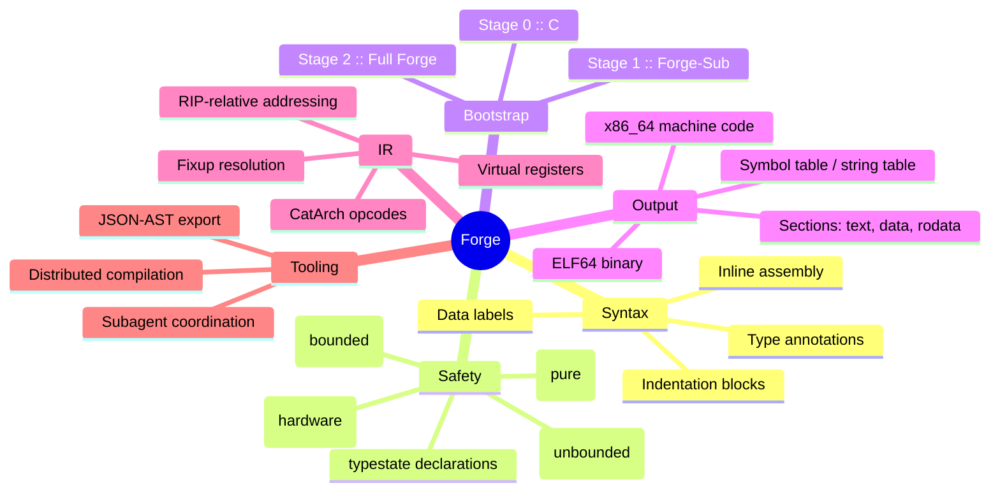
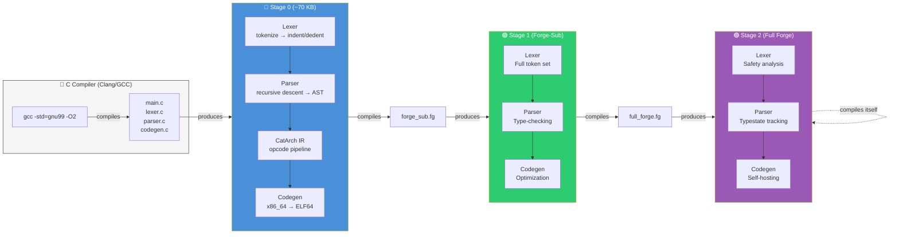
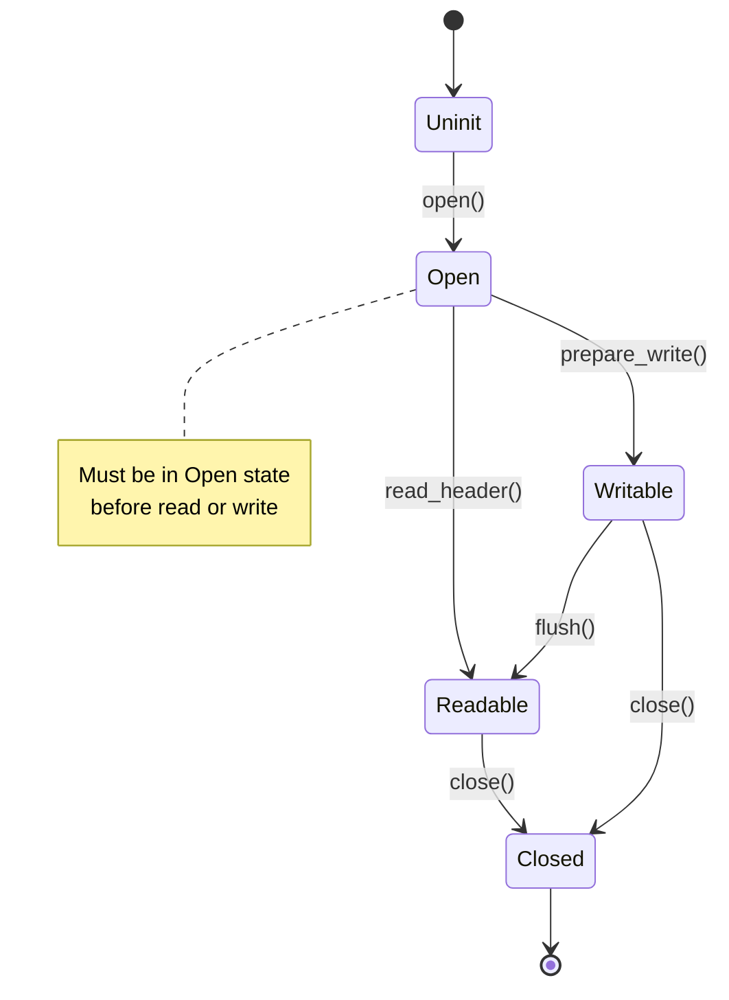
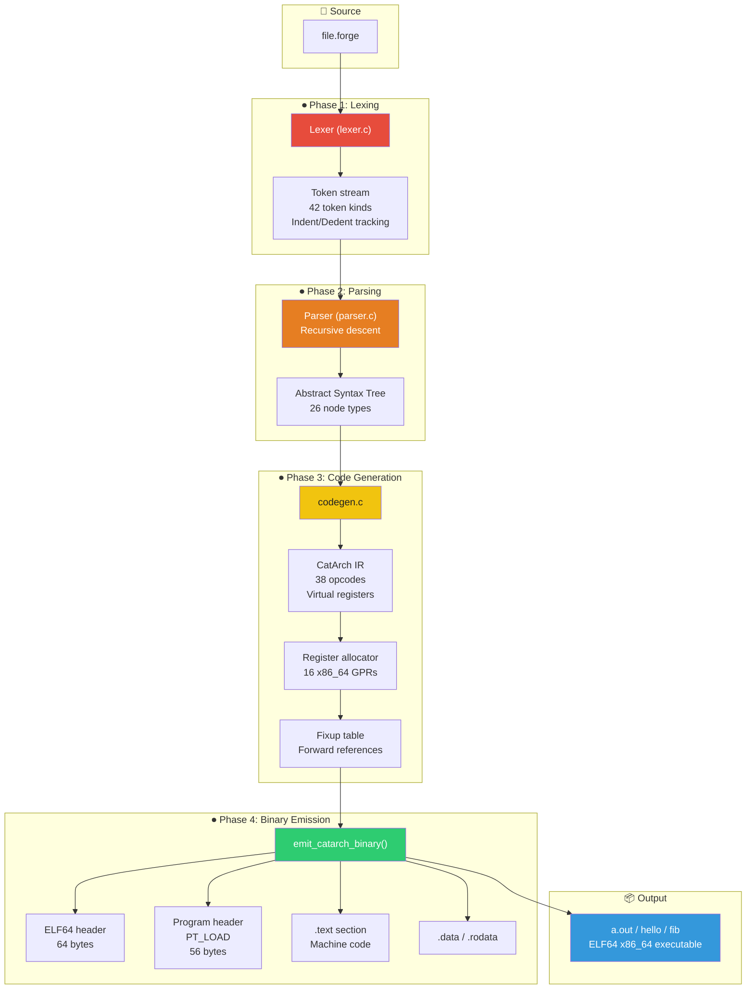

# ⚡ FORGE ⚡

```ascii
╔══════════════════════════════════════════════════════════════════════╗
║                                                                      ║
║    ███████╗ ██████╗ ██████╗  ██████╗ ███████╗                       ║
║    ██╔════╝██╔═══██╗██╔══██╗██╔════╝ ██╔════╝                       ║
║    █████╗  ██║   ██║██████╔╝██║  ███╗█████╗                         ║
║    ██╔══╝  ██║   ██║██╔══██╗██║   ██║██╔══╝                         ║
║    ██║     ╚██████╔╝██║  ██║╚██████╔╝███████╗                       ║
║    ╚═╝      ╚═════╝ ╚═╝  ╚═╝ ╚═════╝ ╚══════╝                       ║
║                                                                      ║
║    ╔══════════════════════════════════════════════════════════════╗   ║
║    ║  Self-hosting systems language                              ║   ║
║    ║  Assembly power  ·  Python clarity  ·  Formal safety        ║   ║
║    ╚══════════════════════════════════════════════════════════════╝   ║
║                                                                      ║
║    ── native x86_64 ELF64 · zero-dependency · 2–8 KB footprint ──   ║
║                                                                      ║
╚══════════════════════════════════════════════════════════════════════╝
```

[](https://opensource.org/licenses/MIT)
[](https://en.wikipedia.org/wiki/C99)
[](https://en.wikipedia.org/wiki/X86-64)
[](https://en.wikipedia.org/wiki/Executable_and_Linkable_Format)
[](forge/stage0/)
[](forge/stage1/)
[](https://en.wikipedia.org/wiki/Self-hosting_(compilers))
[](forge/stage0/)
[](forge/lib)
[](CONTRIBUTING.md)
[](https://en.wikipedia.org/wiki/Bootstrapping_(compilers))

---

## 📦 Quick Demo

```bash
# ── Build Stage 0 (C compiler) ────────────────────────────────────────
$ cd forge/stage0 && make
gcc -Wall -Wextra -O2 -std=gnu99 -c main.c -o main.o
gcc -Wall -Wextra -O2 -std=gnu99 -c lexer.c -o lexer.o
gcc -Wall -Wextra -O2 -std=gnu99 -c parser.c -o parser.o
gcc -Wall -Wextra -O2 -std=gnu99 -c codegen.c -o codegen.o
gcc -Wall -Wextra -O2 -std=gnu99 -o forge main.o lexer.o parser.o codegen.o

# ── Compile hello.forge ───────────────────────────────────────────────
$ ./forge ../examples/hello.forge -o hello
forge: lexing ../examples/hello.forge...
forge: 30 tokens
forge: parsing...
forge: codegen...
forge: 91 bytes generated
forge: writing hello...

# ── Inspect the binary ────────────────────────────────────────────────
$ file hello
hello: ELF 64-bit LSB executable, x86-64, version 1 (SYSV), statically linked

# ── Run it ────────────────────────────────────────────────────────────
$ ./hello
Hello, Forge!
```

No linker. No runtime. No dependencies. One C compiler, one source file, one native executable.

---

## 🔍 What is Forge?

> **Forge** is a self-hosting systems programming language built from first principles. It compiles directly to native x86_64 machine code (ELF64) — no VM, no JIT, no external linker, no libc.

> [!NOTE]
> **Elevator pitch**: Forge gives you the bit-level control of assembly, the readability of Python, and the safety guarantees of Rust — in a compiler small enough to hold in your head.

Forge is purpose-built for two domains at the frontier of systems programming:

| Domain | What Forge brings |
|--------|-------------------|
| **🔧 Reverse Engineering** | Binary layout matching, bi-directional IR, data layout annotations (`layout(packed)`), precise memory representation control |
| **🤖 Artificial Intelligence** | Local-first context, JSON-AST streaming, infrastructure for distributed compilation workloads across 100+ agents |

Every Forge executable is a single static ELF64 binary containing **only** the code you wrote. No startup files, no CRT, no garbage collector. The runtime footprint for a minimal program is **91 bytes** (hello.forge). Typical programs are **2–8 KB**.

---

## 🧠 Philosophy

Forge is built on four pillars:

### Design Tenets

| # | Principle | Meaning |
|:-:|-----------|---------|
| 1 | **Minimal bootstrap** | The Stage 0 compiler is ~70 KB of C99. One source file per pass: lexer, parser, codegen, ELF writer. |
| 2 | **No hidden machinery** | No linker scripts, no libc startup, no assembly stubs you didn't write. What you see is what the CPU executes. |
| 3 | **Safety is explicit, not magical** | Four safety levels (`pure → bounded → hardware → unbounded`) let you declare contracts. The compiler trusts you — and gives you the tools to be trustworthy. |
| 4 | **Pythonic surface, assembly soul** | Indentation-based blocks, clean syntax, type annotations — mapping directly to x86_64 opcodes. |

### Language Design Mindmap



---

## 📐 Syntax Showcase

### Forge vs. C vs. Assembly vs. Python

**`exit(0)`** — the simplest possible program:

| Forge | C | x86_64 Assembly (NASM) | Python |
|-------|---|------------------------|--------|
| ```fn main(): asm volatile: mov rax, 60 xor rdi, rdi syscall return 0 ``` | ```int main() { return 0; }``` | ```section .text global _start _start: mov rax, 60 xor rdi, rdi syscall ``` | ```import sys sys.exit(0) ``` |

> Forge combines the **one-to-one hardware control** of assembly with the **readability** of Python — no `.globl` directives, no section boilerplate, no linker.

### Key syntax features

```forge
# ── Function with return type ─────────────────────────────────────────
fn add(a: i64, b: i64) -> i64:
    return a + b

# ── Mutable variables ────────────────────────────────────────────────
var counter: i64 = 0
counter += 1

# ── Immutable bindings ───────────────────────────────────────────────
let pi: f64 = 3.141592653589793

# ── Const values (compile-time) ──────────────────────────────────────
const MAX_BUF: i64 = 4096

# ── Inline assembly (volatile) ───────────────────────────────────────
asm volatile:
    mov rax, 1
    mov rdi, 1
    lea rsi, [msg]
    mov rdx, 14
    syscall

# ── Data labels ──────────────────────────────────────────────────────
:msg
"Hello, Forge!\n"

# ── Packed struct ────────────────────────────────────────────────────
struct Header layout(packed):
    magic:  u32
    version: u16
    flags:   u16
```

### Token types recognized by the Stage 0 lexer

| Category | Tokens |
|----------|--------|
| **Literals** | `T_INT`, `T_HEX`, `T_BIN`, `T_FLOAT`, `T_STRING` |
| **Keywords** | `K_FN`, `K_LET`, `K_VAR`, `K_STRUCT`, `K_IF`, `K_ELSE`, `K_WHILE`, `K_FOR`, `K_RETURN`, `K_ASM`, `K_VOLATILE`, `K_SAFETY`, `K_PURE`, `K_HARDWARE`, `K_BOUNDED`, `K_UNBOUNDED`, `K_TYPESTATE`, `K_TRUE`, `K_FALSE`, `K_IN`, `K_BREAK`, `K_CONTINUE`, `K_IMPORT`, `K_CAST`, `K_LAYOUT`, `K_PACKED`, `K_SIZE_OF`, `K_ADDR_OF`, `K_UNDEFINED`, `K_CONST`, `K_PUB` |
| **Types** | `T_U8`, `T_U16`, `T_U32`, `T_U64`, `T_I8`, `T_I16`, `T_I32`, `T_I64`, `T_BOOL`, `T_VOID`, `T_PTR`, `T_SLICE`, `T_USIZE` |
| **Operators** | `O_PLUS`, `O_MINUS`, `O_STAR`, `O_SLASH`, `O_PERCENT`, `O_EQ`, `O_NE`, `O_LT`, `O_GT`, `O_LE`, `O_GE`, `O_AND`, `O_OR`, `O_XOR`, `O_SHL`, `O_SHR`, `O_NOT`, `O_BANG`, `O_ASSIGN`, `O_PLUS_EQ`, `O_MINUS_EQ`, `O_STAR_EQ`, `O_AND_AND`, `O_OR_OR` |
| **Delimiters** | `D_LPAREN`, `D_RPAREN`, `D_LBRACK`, `D_RBRACK`, `D_COMMA`, `D_COLON`, `D_SEMI`, `D_DOT`, `D_ARROW`, `D_AT`, `D_LBRACE`, `D_RBRACE` |

---

## 🥚 Stage Bootstrap

Forge achieves self-hosting through a carefully designed **three-stage bootstrap pipeline**:



### Stage details

| Stage | Written in | Description | Status |
|-------|-----------|-------------|--------|
| **Stage 0** | C99 | Minimal compiler: lexer with full indentation tracking, recursive-descent parser, CatArch opcode IR, x86_64 machine code emitter + ELF64 binary writer. ~4000 lines. | ✅ Complete |
| **Stage 1** | Forge-Sub | Restricted subset of Forge. Adds type-checking, richer expressions, and enough power to parse and compile the full language. Self-hosted via Stage 0. | 🔄 In progress |
| **Stage 2** | Full Forge | The complete self-hosting compiler. All safety annotations, typestate tracking, optimization passes, JSON-AST streaming. Forge compiles itself. | 🎯 Target |

---

## 🛡️ Safety System

Forge provides four explicit safety levels. Every `fn` can carry a safety annotation that declares its contract:

| Annotation | Level | Meaning | Use Case |
|:-----------|:-----:|---------|----------|
| `safety(pure)` | 🟢 1 | No side effects. Deterministic, referentially transparent. | Math functions, hash computations |
| `safety(bounded)` | 🔵 2 | Operates within a fixed memory region; bounds-checked. Bounded pointers, no aliasing violations. | Array operations, buffer manipulation |
| `safety(hardware)` | 🟠 3 | Direct hardware access (ports, MMIO, syscalls). Unchecked by design — you control the hardware. | Drivers, kernel code, bootloaders |
| `safety(unbounded)` | 🔴 4 | No safety guarantees. Full programmer responsibility. Pointers, raw memory, arbitrary jumps. | Bootstrapping, embedded, reverse engineering |

### Usage

```forge
# Pure function — compiler can memoize, reorder, eliminate
safety(pure)
fn compute_hash(data: slice(u8)) -> u64:
    ...

# Bounded — must operate within known buffer
safety(bounded)
fn copy_buf(dst: ptr(u8), src: ptr(u8), len: usize):
    ...

# Hardware — syscalls, port I/O, MMIO
safety(hardware)
fn write_serial(c: u8):
    asm volatile:
        mov rax, 1
        mov rdi, 1
        ...

# Unbounded — you're on your own
safety(unbounded)
fn dump_memory(addr: ptr(u8), len: usize):
    ...
```

### Typestate tracking

Forge supports **typestate declarations** for tracking object state through linear type transitions:



```forge
typestate File:
    Uninit
    Open
    Readable
    Writable
    Closed
```

> [!TIP]
> The typestate system lets you encode protocols into the type system — the compiler can verify that you never read a closed file or write to an uninitialized buffer.

---

## 🏗️ Architecture Overview

The Stage 0 compiler is organized as a traditional four-pass pipeline:



### Compiler pipeline data flow

| Stage | File | Input | Output | Key data structures |
|-------|------|-------|--------|-------------------|
| **Lexer** | `lexer.c` | Raw source text | Token array (`Token[]`) | `TokenKind` enum (42 values), `Token` struct with line/col/offset |
| **Parser** | `parser.c` | Token stream | AST (`Node*`) | `NodeKind` enum (26 values), tagged union `Node.as` |
| **Codegen** | `codegen.c` | AST | CatArch IR → x86_64 bytes | `IROp` enum (38 values), `IR` struct, virtual register allocator |
| **Emitter** | `codegen.c` | Code bytes + fixups | ELF64 file | ELF64 header, PT_LOAD program header, chmod 0755 |

### CatArch Intermediate Representation

The IR is a simple RISC-like instruction set, where each instruction maps to 1–6 x86_64 bytes:

| IR Opcode | x86_64 Encoding | Bytes | Description |
|-----------|-----------------|:-----:|-------------|
| `IR_NOP` | `90` | 1 | No operation |
| `IR_MOVI` | `REX.W + C7 /0 id` | 7 | Move immediate |
| `IR_MOV` | `REX.W + 89 /r` | 3 | Move register |
| `IR_LEA` | `REX.W + 8D /r [rip+disp32]` | 7 | Load effective address |
| `IR_ADD` | `REX.W + 01 /r` | 3 | Integer add |
| `IR_SUB` | `REX.W + 29 /r` | 3 | Integer subtract |
| `IR_IMUL` | `REX.W + 0F AF /r` | 4 | Signed multiply |
| `IR_CMP` | `REX.W + 39 /r` | 3 | Compare registers |
| `IR_CMPI` | `REX.W + 81 /7 id` | 7 | Compare immediate |
| `IR_JMP` | `E9 rel32` | 5 | Unconditional jump |
| `IR_JE` / `IR_JNE` | `0F 84/85 rel32` | 6 | Conditional jump |
| `IR_CALL` | `E8 rel32` | 5 | Function call |
| `IR_RET` | `C3` | 1 | Return |
| `IR_SYSCALL` | `0F 05` | 2 | System call |
| `IR_PUSH` | `50+rd` | 1 | Push register |
| `IR_POP` | `58+rd` | 1 | Pop register |
| `IR_HALT` | `F4` | 1 | Halt (HLT) |

### ELF64 binary layout

```
┌────────────────────────────────────────────────────────┐
│  ELF64 Header  (64 bytes)                              │
│  ├─ Magic:  7F 45 4C 46                                │
│  ├─ Class:  2 (64-bit)                                 │
│  ├─ Data:   1 (little-endian)                          │
│  ├─ Type:   2 (ET_EXEC)                                │
│  ├─ Machine: 0x3E (x86_64)                             │
│  └─ Entry:  0x400000 + 128 + offset_of_main            │
├────────────────────────────────────────────────────────┤
│  Program Header Table  (56 bytes)                      │
│  ├─ Type:   PT_LOAD (1)                                │
│  ├─ Flags:  PF_R | PF_X (5)                            │
│  ├─ Offset: 0                                          │
│  ├─ VAddr:  0x400000                                   │
│  ├─ PAddr:  0x400000                                   │
│  ├─ Filesz: 128 + code_len                             │
│  ├─ Memsz:  128 + code_len                             │
│  └─ Align:  0x1000                                     │
├────────────────────────────────────────────────────────┤
│  Padding  (64 bytes, zeros)                            │
├────────────────────────────────────────────────────────┤
│  .text section:  x86_64 machine code                   │
│  ├─ Function prologue                                  │
│  ├─ Function bodies                                    │
│  └─ Data strings (embedded)                            │
└────────────────────────────────────────────────────────┘
```

---

## 🛠️ Build & Run

### Prerequisites

| Tool | Minimum version | Purpose |
|------|----------------|---------|
| `gcc` or `clang` | > 11 (GCC) / > 14 (Clang) | Compile Stage 0 |
| `make` | > 4.0 | Build orchestration |
| `file` | any | Verify ELF output |
| Linux / macOS | — | Runtime (x86_64 host) |

> [!IMPORTANT]
> Forge targets **x86_64 Linux and macOS** (via syscall translation). The Stage 0 compiler itself is portable C99 and builds on any POSIX system.

### Build the Stage 0 compiler

```bash
cd forge/stage0
make
```

Expected output:

```
gcc -Wall -Wextra -O2 -std=gnu99 -c main.c -o main.o
gcc -Wall -Wextra -O2 -std=gnu99 -c lexer.c -o lexer.o
gcc -Wall -Wextra -O2 -std=gnu99 -c parser.c -o parser.o
gcc -Wall -Wextra -O2 -std=gnu99 -c codegen.c -o codegen.o
gcc -Wall -Wextra -O2 -std=gnu99 -o forge main.o lexer.o parser.o codegen.o
-rwxr-xr-x  1 user  staff  72504 Jun  2 12:00 forge
forge: compiler binary: 72504 bytes
```

### Compile and run examples

```bash
# exit.forge — minimal program (just exit(0))
./forge ../examples/exit.forge -o exit
forge: lexing ../examples/exit.forge...
forge: 9 tokens
forge: parsing...
forge: codegen...
forge: 31 bytes generated
forge: writing exit...
./exit; echo $?
0

# hello.forge — print to stdout
./forge ../examples/hello.forge -o hello
./hello
Hello, Forge!

# fib.forge — recursive fibonacci (f(10) = 55)
./forge ../examples/fib.forge -o fib
./fib; echo $?
0
```

### Run the test suite

```bash
cd forge/stage0 && make test
```

This compiles every `.forge` in `../examples/` and verifies each produces a valid ELF binary.

### Build output size comparison

| Example | Source size | Generated code | Total binary |
|---------|:-----------:|:--------------:|:------------:|
| `exit.forge` | 47 B | 31 B | 159 B |
| `hello.forge` | 175 B | 91 B | 219 B |
| `fib.forge` | 446 B | 131 B | 259 B |

---

## 🖼️ Examples Gallery

### 1. `exit.forge` — The minimal program

```forge
# The simplest possible Forge program.
# Calls the exit(0) syscall (syscall 60) and returns 0.

fn main():
    asm volatile:
        mov rax, 60    # syscall number: exit
        xor rdi, rdi   # status code: 0
        syscall        # invoke kernel
    return 0
```

<details>
<summary>🔍 Click to see what the compiler generates</summary>

```asm
; ELF entry = 0x400000 + 128 + offset_of_main
;
; Prologue
push   rbp              ; 55
mov    rbp, rsp         ; 48 89 e5
sub    rsp, 0           ; 48 81 ec 00 00 00 00

; asm volatile block
mov    rax, 60          ; 48 c7 c0 3c 00 00 00
xor    rdi, rdi         ; 48 31 ff
syscall                ; 0f 05

; Return sequence
mov    rsp, rbp         ; 48 89 ec
pop    rbp              ; 5d
ret                     ; c3
```

Total: **31 bytes** of machine code.
</details>

### 2. `hello.forge` — Hello, world!

```forge
# Hello World in Forge
# Uses the write syscall (syscall 1) to print a string,
# then exit to clean up.

fn main() -> i64:
    asm volatile:
        mov rax, 1        # syscall number: write
        mov rdi, 1        # fd: stdout
        lea rsi, [msg]    # buf: pointer to data label
        mov rdx, 14       # count: 14 bytes
        syscall           # invoke write(1, msg, 14)
        mov rax, 60       # syscall number: exit
        xor rdi, rdi      # status: 0
        syscall           # invoke exit(0)
    return 0

:msg
"Hello, Forge!\n"
```

<details>
<summary>🔍 Line-by-line walkthrough</summary>

| Line | What it does |
|------|-------------|
| `fn main() -> i64:` | Defines the entry point. Returns i64 (exit code). |
| `asm volatile:` | Opens an inline assembly block. `volatile` prevents the compiler from reordering or eliminating it. |
| `mov rax, 1` | Sets the syscall number for `write` (Linux syscall 1). |
| `mov rdi, 1` | First argument: file descriptor 1 = stdout. |
| `lea rsi, [msg]` | Second argument: load effective address of the data label `msg`. Uses RIP-relative addressing. |
| `mov rdx, 14` | Third argument: byte count (length of "Hello, Forge!\n"). |
| `syscall` | Invokes the kernel. |
| `mov rax, 60; xor rdi, rdi; syscall` | Exit syscall with status 0. |
| `return 0` | Fallthrough return (for the type signature). |
| `:msg` | Data label — resolved at assembly time. |
| `"Hello, Forge!\n"` | String literal emitted as raw bytes + null terminator. |
</details>

### 3. `fib.forge` — Recursive Fibonacci

```forge
# Fibonacci using asm blocks and function calls
# Computes fib(10) = 55 via recursive calls
#
# Register convention:
#   rdi = first argument (n)
#   rax = return value

fn fib(n: i64) -> i64:
    asm volatile:
        mov rax, rdi      # rax = n
        cmp rax, 2        # if n < 2, return n
        jl _base
        push rbx          # save rbx (callee-saved)
        dec rax           # rax = n - 1
        mov rdi, rax      # arg = n - 1
        call fib          # fib(n - 1)
        mov rbx, rax      # rbx = fib(n - 1)
        mov rax, rdi      # rax = n (original value)
        sub rax, 2        # rax = n - 2
        mov rdi, rax      # arg = n - 2
        call fib          # fib(n - 2)
        add rax, rbx      # rax = fib(n - 2) + fib(n - 1)
        pop rbx           # restore rbx
        ret
        :_base
        ret

fn main() -> i64:
    asm volatile:
        mov rdi, 10       # arg: compute fib(10)
        call fib          # call fib(10)
        mov rax, 60       # exit
        xor rdi, rdi
        syscall
```

> [!NOTE]
> The Fibonacci example demonstrates: function calls with the System V AMD64 ABI (args in `rdi`, return in `rax`), callee-saved register preservation (`rbx`), forward label references (the `_base` label), and chained syscalls.

---

## 🧪 Compiler Internals Deep Dive

### Lexer (`lexer.c`)

The lexer converts raw source text into a flat array of `Token` structs. Key features:

- **Indentation tracking**: Produces `T_INDENT` / `T_DEDENT` tokens for off-side rule blocks (no braces needed)
- **Numeric literals**: Decimal (`42`), hex (`0xFF`), binary (`0b1010`)
- **String literals**: Double-quoted, stored in `Token.str_val`
- **Comment stripping**: Lines starting with `#` are treated as whitespace

```c
// From forge.h — the Token structure
typedef struct {
    TokenKind kind;
    int64_t   int_val;
    double    float_val;
    char*     str_val;
    int       line;
    int       col;
    int       offset; /* byte offset in source */
} Token;
```

### Parser (`parser.c`)

A hand-written recursive-descent parser that produces a `Node*` AST:

```c
// AST node — tagged union of 26 node kinds
typedef struct Node {
    NodeKind kind;
    int      line, col;
    union {
        struct { struct Node** stmts; int count; } program;
        struct { char* name; struct Node** params; int pcount;
                 struct Node* ret_type; struct Node* body;
                 struct Node* safety; int is_pub; } func;
        struct { char* name; struct Node* type; struct Node* init;
                 int is_mut; int is_const; } var;
        // ... 20+ more variants
    } as;
} Node;
```

### Code Generator (`codegen.c`)

The most complex pass, responsible for three transformations:

1. **AST → CatArch IR**: Walks the AST, emitting IR instructions into a fixed-size array. Virtual registers are allocated on the fly (starting at vreg 8).
2. **IR → x86_64 machine code**: Translates each IR opcode to the corresponding x86_64 byte sequence. Handles:
   - REX prefix encoding (64-bit operands)
   - ModR/M byte calculation
   - RIP-relative addressing for data labels
   - Forward reference resolution via the fixup table
   - Immediate encoding (32-bit sign-extended or 64-bit absolute)
3. **ELF64 binary emission**: Constructs the ELF header and program header table from scratch, then writes the machine code as a single PT_LOAD segment.

### Compiler limits (Stage 0)

| Limit | Value |
|-------|-------|
| Maximum source size | 4 MB |
| Maximum tokens | 65,536 |
| Maximum labels | 4,096 |
| Maximum functions | 1,024 |
| Maximum local variables | 256 |
| Maximum string literals | 1,024 |
| Maximum includes | 64 |
| Maximum IR instructions | 131,072 |
| Maximum fixup entries | 65,536 |

---

## 🗺️ Roadmap

### Stage 0 — Bootstrap compiler ✅

- [x] Lexer with full indentation tracking
- [x] Recursive-descent parser producing AST
- [x] CatArch opcode IR
- [x] x86_64 code generator (REX, ModR/M, RIP-relative)
- [x] Direct ELF64 binary emitter (no external linker)
- [x] Inline assembly blocks (`asm volatile`)
- [x] Data labels and string literals
- [x] Forward reference resolution
- [x] Function calls (System V AMD64 ABI)
- [x] Conditional branches and comparison
- [x] Arithmetic operations (add, sub, mul, and, or, xor, shift)
- [x] Comment stripping (`#`)
- [x] Test suite (`make test`)
- [x] Subagent distributed development model

### Stage 1 — Forge-Sub compiler 🔄

- [ ] Type checking and inference
- [ ] Full expression parser (all operator precedence levels)
- [ ] String concatenation and formatting
- [ ] Array and slice types
- [ ] Struct field access and `layout(packed)`
- [ ] `safety()` annotation enforcement
- [ ] `import` / module system
- [ ] Self-compiling: Stage 1 can compile itself
- [ ] Static single-assignment (SSA) IR
- [ ] Basic optimization passes (constant folding, dead code elimination)

### Stage 2 — Full Forge compiler 🎯

- [ ] Typestate tracking and verification
- [ ] Linear type system for resource management
- [ ] Generics / parametric polymorphism
- [ ] Pattern matching
- [ ] Algebraic data types (enums with payloads)
- [ ] Trait / interface system
- [ ] Memory safety with borrow checking
- [ ] JSON-AST streaming API
- [ ] Distributed compilation across 100 subagents
- [ ] Cross-compilation backend framework
- [ ] Self-hosting: Full Forge compiles itself
- [ ] Package manager
- [ ] Language server protocol (LSP) support
- [ ] WebAssembly backend

### Ecosystem 🔭

- [ ] Standard library (libc-free)
- [ ] Documentation generator
- [ ] Forge playground (web-based REPL)
- [ ] VSCode extension with syntax highlighting
- [ ] AOT compilation for embedded targets
- [ ] Formal verification integration (Coq / Lean)

---

## 🤝 Contributing

Forge is open to contributions from everyone — humans and agents alike. The project follows a **100 subagent participation model** where hundreds of independent contributors can work concurrently.

```
┌─────────────────────────────────────────────────────────────────┐
│                                                                 │
│  1. Fork the repository                                         │
│  2. Create a feature branch: `git checkout -b feat/my-change`   │
│  3. Make small, focused commits                                 │
│  4. Run `make test` — all examples must pass                    │
│  5. Open a Pull Request against `main`                          │
│                                                                 │
└─────────────────────────────────────────────────────────────────┘
```

### Quick start

```bash
cd forge/stage0 && make
./forge ../examples/exit.forge -o /tmp/exit && /tmp/exit
./forge ../examples/hello.forge -o /tmp/hello && /tmp/hello
./forge ../examples/fib.forge -o /tmp/fib && /tmp/fib
```

### Code style

| Rule | Convention |
|------|-----------|
| **Indentation** | 4 spaces (no tabs) |
| **Naming** | `snake_case` for functions, variables, types |
| **Stage 0** | C99, compiled with `-Wall -Wextra -Werror` |
| **Stage 1** | Forge-Sub, must pass safety checker |
| **Trailing whitespace** | Never |
| **File ending** | Single newline at EOF |

See [`CONTRIBUTING.md`](CONTRIBUTING.md) for the full contributor guide.

---

## 📋 FAQ

<details>
<summary><b>Why not use LLVM?</b></summary>

Because Forge is designed to be **understood by one person**. LLVM adds millions of lines of dependency, complex build systems, and opaque abstractions. Forge's Stage 0 compiler is ~4,000 lines of C99 — a single developer can hold the entire compiler in their head. This is essential for trust, portability, and bootstrapping.
</details>

<details>
<summary><b>Does Forge have a standard library?</b></summary>

Not yet — and that's by design. Forge programs interact with the kernel directly via syscalls. A standard library (`forge/lib`) is planned but will remain optional and small. Forge is not trying to replace C++ or Rust for large codebases; it's targeting the space where you currently reach for assembly or bare-metal C.
</details>

<details>
<summary><b>Can I use Forge on ARM / RISC-V / WebAssembly?</b></summary>

The current Stage 0 only targets x86_64. The architecture is designed so that new backends can be added as separate codegen modules. Stage 2 will introduce a backend framework with targets for ARM64, RISC-V, and WebAssembly.
</details>

<details>
<summary><b>Why is the compiler called "Forge"?</b></summary>

The name evokes the image of a blacksmith's forge — raw materials (metal, fire, hammer) transformed into a finished tool. Similarly, Forge transforms raw assembly instructions and safety annotations into a finished executable. It also hints at "forging" new paths in systems language design.
</details>

<details>
<summary><b>What does "catarch" mean in `emit_catarch_binary()`?</b></summary>

"CatArch" is the internal name for Forge's intermediate representation. It's derived from the project codename "Cat" and "Architecture" — a feline-inspired architecture for compiler IR.
</details>

<details>
<summary><b>How do I read a Forge compiler error?</b></summary>

The Stage 0 compiler prints errors to stderr with the format:
```
error at line 42, col 10: unexpected token 'foo'
```
The compiler reports all errors it can find before aborting. Error messages aim to be precise and actionable. Full error reporting is tracked in the Roadmap.
</details>

<details>
<summary><b>Is Forge production-ready?</b></summary>

Forge is currently in **early development** (v0.1.0). The Stage 0 bootstrap compiler works and produces correct ELF64 binaries, but the language is not yet self-hosting. Use Forge for learning, experimentation, and bootstrapping research — not for production systems. The Roadmap section shows the path to maturity.
</details>

<details>
<summary><b>How does Forge compare to other systems languages?</b></summary>

| Feature | Forge | C | Rust | Zig | Assembly |
|---------|-------|---|------|-----|----------|
| **Self-hosting** | ✅ (target) | ✅ | ✅ | ✅ | ✅ |
| **Zero deps** | ✅ | ✅ | ❌ (LLVM) | ✅ | ✅ |
| **Indentation syntax** | ✅ | ❌ | ❌ | ❌ | ❌ |
| **Safety annotations** | ✅ (4 levels) | ❌ | ✅ (borrowck) | ❌ | ❌ |
| **Inline assembly** | ✅ | ✅ | ✅ | ✅ | N/A |
| **Direct ELF output** | ✅ | ❌ (needs ld) | ❌ (needs ld) | ❌ (needs ld) | ❌ (needs ld) |
| **Runtime footprint** | 2–8 KB | ~16 KB (min) | ~500 KB (min) | ~30 KB (min) | ~200 B |
| **Compiler size** | ~70 KB | millions | millions | ~200 MB | ~1 MB |
| **Typestate tracking** | ✅ | ❌ | ❌ | ❌ | ❌ |
</details>

<details>
<summary><b>What is the subagent participation model?</b></summary>

Forge follows a **100 subagents** development model: the project is intentionally structured so that hundreds of independent agents (human or automated) can contribute concurrently without central coordination. Each agent works in its own fork, self-validates against the core test suite, and submits small atomic PRs. The compiler pipeline, standard library, and examples are independently modifiable, minimizing merge conflicts through strict separation of concerns.
</details>

<details>
<summary><b>Can Forge programs use libc?</b></summary>

Forge does **not** link against libc by default — programs make syscalls directly via `asm volatile` blocks. This keeps the runtime footprint minimal and ensures binary portability across Linux kernel versions. If needed, you can call libc functions via the FFI (planned for Stage 2), but the core design philosophy is to avoid any dependency on a C runtime.
</details>

<details>
<summary><b>How do I debug a Forge program?</b></summary>

Forge binaries are standard ELF64 executables, so you can use standard tools:

| Tool | Command | Purpose |
|------|---------|---------|
| `gdb` | `gdb ./hello` | Step through x86_64 instructions |
| `objdump` | `objdump -d ./hello` | Disassemble the binary |
| `strace` | `strace ./hello` | Trace syscalls |
| `file` | `file ./hello` | Verify ELF format |
| `xxd` | `xxd ./hello \| head -20` | Hex dump of header |
</details>

<details>
<summary><b>What does `volatile` mean in `asm volatile`?</b></summary>

The `volatile` keyword on an `asm` block tells the compiler not to optimize, reorder, or eliminate the block. This is critical when the assembly has side effects that the compiler cannot see (like syscalls, MMIO writes, or instruction-side effects on flags). Without `volatile`, the compiler might decide the block is dead code and remove it entirely.
</details>

<details>
<summary><b>How does indentation-based syntax work in the lexer?</b></summary>

Forge's lexer tracks the current indentation level (number of leading spaces). When a new line has more spaces than the current level, it emits a `T_INDENT` token. When it has fewer spaces, it emits one or more `T_DEDENT` tokens. This is how the parser knows where blocks begin and end — exactly the same mechanism used by Python. The lexer handles edge cases like blank lines, comments, and mixed indentation (which is an error).
</details>

<details>
<summary><b>Where can I ask questions?</b></summary>

- **GitHub Issues**: Bug reports, feature requests, questions
- **Discussions**: GitHub Discussions tab for general chat
- **PRs**: Code contributions via pull requests
- **Forge website**: [https://forge-lang.org](https://forge-lang.org) (coming soon)
</details>

---

## 📚 Project Structure

```
cat/                              # Repository root
├── cat.toml                      # Project configuration
├── README.md                     # This file
├── CONTRIBUTING.md               # Contributor guide
├── CHANGELOG.md                  # Version history
├── LICENSE                       # MIT License
├── assets/                       # Media and branding
│   └── ...
├── forge/                        # Compiler source
│   ├── stage0/                   # Stage 0 bootstrap compiler (C99)
│   │   ├── forge.h               #  ─ Shared definitions (tokens, AST, compiler context)
│   │   ├── main.c                #  ─ Entry point, compiler driver
│   │   ├── lexer.c               #  ─ Lexer (tokenizer + indent tracking)
│   │   ├── parser.c              #  ─ Recursive descent parser
│   │   ├── codegen.c             #  ─ Code generator (IR → x86_64 → ELF64)
│   │   ├── Makefile              #  ─ Build system
│   │   └── forge                 #  ─ Built compiler binary
│   ├── stage1/                   # Stage 1: Forge-Sub (WIP)
│   │   └── ...
│   ├── stage2/                   # Stage 2: Full Forge (planned)
│   │   └── ...
│   ├── lib/                      # Standard library
│   │   └── ...
│   └── examples/                 # Example programs
│       ├── hello.forge           #  ─ Hello, World!
│       ├── exit.forge            #  ─ Minimal exit
│       └── fib.forge             #  ─ Recursive Fibonacci
└── .github/                      # GitHub Actions, templates
    └── ...
```

---

## ⚖️ License

```
MIT License

Copyright (c) 2025–2026 Forge Contributors

Permission is hereby granted, free of charge, to any person obtaining a copy
of this software and associated documentation files (the "Software"), to deal
in the Software without restriction, including without limitation the rights
to use, copy, modify, merge, publish, distribute, sublicense, and/or sell
copies of the Software, and to permit persons to whom the Software is
furnished to do so, subject to the following conditions:

The above copyright notice and this permission notice shall be included in all
copies or substantial portions of the Software.

THE SOFTWARE IS PROVIDED "AS IS", WITHOUT WARRANTY OF ANY KIND, EXPRESS OR
IMPLIED, INCLUDING BUT NOT LIMITED TO THE WARRANTIES OF MERCHANTABILITY,
FITNESS FOR A PARTICULAR PURPOSE AND NONINFRINGEMENT. IN NO EVENT SHALL THE
AUTHORS OR COPYRIGHT HOLDERS BE LIABLE FOR ANY CLAIM, DAMAGES OR OTHER
LIABILITY, WHETHER IN AN ACTION OF CONTRACT, TORT OR OTHERWISE, ARISING FROM,
OUT OF OR IN CONNECTION WITH THE SOFTWARE OR THE USE OR OTHER DEALINGS IN THE
SOFTWARE.
```

[](LICENSE)

---

<div align="center">

**Forge** — *Assembly power, Python clarity, formal safety.*

<sub>Built with ⚡ from scratch — no dependencies, no magic, just code.</sub>

</div>
