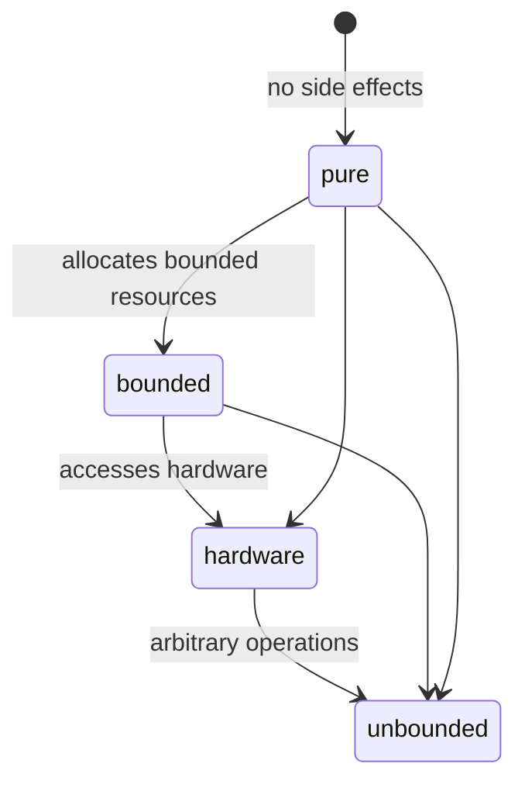
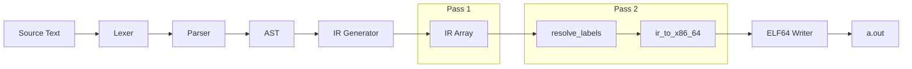

# Forge Language Specification

╔══════════════════════════════════════════════════════════════════════════════════╗
║                     ███████╗ ██████╗ ██████╗  ██████╗ ███████╗                 ║
║                     ██╔════╝██╔═══██╗██╔══██╗██╔════╝ ██╔════╝                 ║
║                     █████╗  ██║   ██║██████╔╝██║  ███╗█████╗                   ║
║                     ██╔══╝  ██║   ██║██╔══██╗██║   ██║██╔══╝                   ║
║                     ██║     ╚██████╔╝██║  ██║╚██████╔╝███████╗                 ║
║                     ╚═╝      ╚═════╝ ╚═╝  ╚═╝ ╚═════╝ ╚══════╝                 ║
║                                                                                  ║
║            ██╗      █████╗ ███╗   ██╗ ██████╗ ██╗   ██╗ █████╗                  ║
║            ██║     ██╔══██╗████╗  ██║██╔════╝ ██║   ██║██╔══██╗                 ║
║            ██║     ███████║██╔██╗ ██║██║  ███╗██║   ██║███████║                 ║
║            ██║     ██╔══██║██║╚██╗██║██║   ██║██║   ██║██╔══██║                 ║
║            ███████╗██║  ██║██║ ╚████║╚██████╔╝╚██████╔╝██║  ██║                 ║
║            ╚══════╝╚═╝  ╚═╝╚═╝  ╚═══╝ ╚═════╝  ╚═════╝ ╚═╝  ╚═╝                 ║
║                                                                                  ║
║                    ███████╗██████╗ ███████╗ ██████╗██╗███████╗                 ║
║                    ██╔════╝██╔══██╗██╔════╝██╔════╝██║██╔════╝                 ║
║                    ███████╗██████╔╝█████╗  ██║     ██║███████╗                 ║
║                    ╚════██║██╔═══╝ ██╔══╝  ██║     ██║╚════██║                 ║
║                    ███████║██║     ███████╗╚██████╗██║███████║                 ║
║                    ╚══════╝╚═╝     ╚══════╝ ╚═════╝╚═╝╚══════╝                 ║
║                                                                                  ║
║             STAGE 0 — BOOTSTRAP SUBSET (Forge-Sub)                               ║
║             Language Specification — Version 0.1.0                                ║
╚══════════════════════════════════════════════════════════════════════════════════╝


---

## Table of Contents

1.  [Introduction](#1-introduction)
2.  [Lexical Structure](#2-lexical-structure)
3.  [Syntax Grammar](#3-syntax-grammar)
4.  [AST Specification](#4-ast-specification)
5.  [Type System](#5-type-system)
6.  [Semantic Analysis](#6-semantic-analysis)
7.  [IR Specification](#7-ir-specification)
8.  [Code Generation](#8-code-generation)
9.  [Runtime Model](#9-runtime-model)
10. [Calling Convention](#10-calling-convention)
11. [Standard Library](#11-standard-library)
12. [Safety Specification](#12-safety-specification)
13. [Implementation Limits](#13-implementation-limits)
14. [References](#14-references)

---

## 1. Introduction

### 1.1 Scope

This document defines the **Forge-Sub** language specification — the Stage 0 bootstrap subset of the Forge programming language. Forge-Sub is a low-level systems programming language that combines:

*   **Assembly-level power** — direct `asm` blocks for inline x86_64 machine code
*   **Python-like syntax** — indentation-based scoping, no braces
*   **Formal safety annotations** — the `safety()` mechanism for tracking code purity and boundedness
*   **Minimal runtime** — no standard library dependency, no garbage collector

> **Design Rationale**
> The bootstrap strategy uses three stages:
> *   **Stage 0 (Forge-Sub):** Written in C, compiles a minimal subset with inline assembly
> *   **Stage 1:** Written in Forge-Sub, extends the compiler with richer features
> *   **Stage 2:** Full self-hosting Forge compiler written in Forge

### 1.2 Conformance

A conforming Forge-Sub implementation shall:

1.  Lex source text according to §2
2.  Parse tokens into an AST according to §3
3.  Generate correct x86_64 machine code according to §7–§8
4.  Produce ELF64 executables runnable on Linux x86_64

### 1.3 Terminology

Term
: Definition

**Token**
: The smallest unit of lexical significance, produced by the lexer.

**AST**
: Abstract Syntax Tree — the parser's intermediate representation.

**IR**
: Internal Representation — an array of RISC-like opcodes between the AST and x86_64 machine code.

**Fixup**
: A pending label relocation that is resolved during the second pass of code generation.

**Forge-Sub**
: The Stage 0 bootstrap subset defined by this specification.

**Safety level**
: One of `pure` (0), `bounded` (1), `hardware` (2), or `unbounded` (3).

### 1.4 Notation

Throughout this document, the following notations are used:

| Notation | Meaning |
|----------|---------|
| `ε` | Empty production |
| `a*` | Zero or more repetitions of `a` |
| `a+` | One or more repetitions of `a` |
| `a?` | Optional `a` |
| `a \| b` | Choice between `a` and `b` |
| `→` | Derives to / produces |
| `/* ... */` | EBNF comment |
| **bold** | Keyword or terminal |
| *italic* | Non-terminal |

---

## 2. Lexical Structure

### 2.1 Character Set

Forge source text is UTF-8 encoded ASCII. The lexer processes bytes sequentially.
Only the printable ASCII subset (U+0020–U+007E), horizontal tab (`\t`, U+0009),
newline (`\n`, U+000A), and carriage return (`\r`, U+000D) are recognized.

### 2.2 Whitespace and Newlines

Whitespace consists of spaces (U+0020), tabs (U+0009), and newlines (U+000A).
A tab character counts as **8 spaces** for indentation calculation[^1].

[^1]: This is a hard-coded constant in `lexer.c:73` — `if (c->src[c->pos] == '\t') level += 8`.

```c
/* Tab expansion: each '\t' adds 8 to the indentation level */
if (c->src[c->pos] == '\t') level += 8;
else level++;
```

### 2.3 Comments

Comments begin with `#` and extend to the end of the current line. They are
treated as whitespace and do not produce tokens.

```forge
# This is a comment
fn main():   # Inline comment
    return 0
```

Comments are handled in the lexer by skipping all characters from `#` to `\n`:

```c
/* lexer.c:120–125 */
if (ch == '#') {
    while (c->pos < (int)c->src_len && c->src[c->pos] != '\n') {
        c->pos++; col++;
    }
    continue;
}
```

### 2.4 Indentation (Off-Side Rule)

Forge uses the **off-side rule** — indentation determines block structure.
The lexer maintains an **indentation stack** and emits `T_INDENT` and `T_DEDENT`
tokens when the indentation level changes.

#### 2.4.1 Indentation Algorithm

```
┌─────────────────────────────────────────────────────────────────────┐
│  indent_stack = [0]                                                 │
│  top = 0                                                            │
│  at_line_start = true                                               │
│                                                                     │
│  for each line:                                                     │
│    measure leading whitespace → level                               │
│    if level > indent_stack[top]:                                    │
│        emit T_INDENT                                                │
│        push level onto indent_stack                                 │
│    elif level < indent_stack[top]:                                  │
│        while level < indent_stack[top]:                             │
│            emit T_DEDENT                                            │
│            pop indent_stack                                         │
│                                                                     │
│  at EOF:                                                            │
│    pop all remaining entries → emit T_DEDENT for each               │
│    emit T_EOF                                                       │
└─────────────────────────────────────────────────────────────────────┘
```

**Example:**

```forge
fn main():          # indent_stack: [0], level=0
    asm:            # level=4 > 0 → T_INDENT, stack=[0,4]
        mov rax, 1  # level=8 > 4 → T_INDENT, stack=[0,4,8]
    return 0        # level=4 < 8 → T_DEDENT, stack=[0,4]
                    # level=0 < 4 → T_DEDENT, stack=[0]
```

### 2.5 Keywords

The following 34 reserved words are recognized by the `word_to_keyword()` function
in `lexer.c:32–53`:

| Keyword | Token | Category |
|---------|-------|----------|
| `fn` | `K_FN` | Declaration |
| `let` | `K_LET` | Declaration |
| `var` | `K_VAR` | Declaration |
| `const` | `K_CONST` | Declaration |
| `pub` | `K_PUB` | Declaration |
| `struct` | `K_STRUCT` | Declaration |
| `typestate` | `K_TYPESTATE` | Declaration |
| `import` | `K_IMPORT` | Declaration |
| `if` | `K_IF` | Control flow |
| `else` | `K_ELSE` | Control flow |
| `while` | `K_WHILE` | Control flow |
| `for` | `K_FOR` | Control flow |
| `in` | `K_IN` | Control flow |
| `return` | `K_RETURN` | Control flow |
| `break` | `K_BREAK` | Control flow |
| `continue` | `K_CONTINUE` | Control flow |
| `asm` | `K_ASM` | Inline assembly |
| `volatile` | `K_VOLATILE` | Qualifier |
| `safety` | `K_SAFETY` | Annotation |
| `pure` | `K_PURE` | Safety level |
| `bounded` | `K_BOUNDED` | Safety level |
| `hardware` | `K_HARDWARE` | Safety level |
| `unbounded` | `K_UNBOUNDED` | Safety level |
| `true` | `K_TRUE` | Literal |
| `false` | `K_FALSE` | Literal |
| `cast` | `K_CAST` | Operator |
| `sizeof` | `K_SIZE_OF` | Operator |
| `addr_of` | `K_ADDR_OF` | Operator |
| `layout` | `K_LAYOUT` | Attribute |
| `packed` | `K_PACKED` | Attribute |
| `undefined` | `K_UNDEFINED` | Sentinal |
| `usize` | `T_USIZE` | Type keyword |
| `void` | `T_VOID` | Type keyword |
| `bool` | `T_BOOL` | Type keyword |

### 2.6 Type Keywords

The following type keywords are reserved:

| Keyword | Token | Size | Signed | C Equivalent |
|---------|-------|------|--------|-------------|
| `u8` | `T_U8` | 1 byte | No | `uint8_t` |
| `u16` | `T_U16` | 2 bytes | No | `uint16_t` |
| `u32` | `T_U32` | 4 bytes | No | `uint32_t` |
| `u64` | `T_U64` | 8 bytes | No | `uint64_t` |
| `i8` | `T_I8` | 1 byte | Yes | `int8_t` |
| `i16` | `T_I16` | 2 bytes | Yes | `int16_t` |
| `i32` | `T_I32` | 4 bytes | Yes | `int32_t` |
| `i64` | `T_I64` | 8 bytes | Yes | `int64_t` |
| `bool` | `T_BOOL` | 1 byte | No | `_Bool` |
| `void` | `T_VOID` | 0 bytes | — | `void` |
| `usize` | `T_USIZE` | 8 bytes | No | `size_t` |

### 2.7 Identifiers

An identifier is a sequence of alphanumeric characters and underscores that
does **not** start with a digit.

```ebnf
(* Identifier grammar *)
ident_start = letter | "_" ;
ident_cont  = letter | digit | "_" ;
identifier  = ident_start , { ident_cont } ;
```

The lexer functions are:

```c
static int is_ident_start(char c) {
    return isalpha((unsigned char)c) || c == '_';
}
static int is_ident_cont(char c) {
    return isalnum((unsigned char)c) || c == '_';
}
```

> **Note:** Stage 0 does not enforce a maximum identifier length, but the
> keyword detection buffer is 128 bytes (`char buf[128]` at `lexer.c:229`).

### 2.8 Literals

#### 2.8.1 Integer Literals

| Form | Prefix | Example | Base |
|------|--------|---------|------|
| Decimal | — | `42` | 10 |
| Hexadecimal | `0x` / `0X` | `0xFF` | 16 |
| Binary | `0b` / `0B` | `0b1010` | 2 |

```ebnf
integer_literal = decimal_literal | hex_literal | binary_literal ;
decimal_literal = digit , { digit } ;
hex_literal     = "0x" , hex_digit , { hex_digit }
                | "0X" , hex_digit , { hex_digit } ;
binary_literal  = "0b" , binary_digit , { binary_digit }
                | "0B" , binary_digit , { binary_digit } ;
```

The lexer detection logic at `lexer.c:173–219`:

```mermaid
flowchart TD
    A[isdigit(ch)] --> B{ch == '0' and\npos+1 < len?}
    B -->|Yes| C{nx == 'x' or 'X'?}
    C -->|Yes| D[Parse hex: v = v<<4 | hex_val]
    C -->|No| E{nx == 'b' or 'B'?}
    E -->|Yes| F[Parse binary: v = v<<1 | bit]
    E -->|No| G{A dot\nfollows?}
    B -->|No| G
    G -->|Yes| H[Parse float: fv += digit/div]
    G -->|No| I[Parse decimal: v = v*10 + digit]
```

> **Representation:** All integer values are stored as `int64_t`. Hex and binary
> values accumulate via left-shift operations during lexing.

#### 2.8.2 Float Literals

```ebnf
float_literal = digit , { digit } , "." , { digit } ;
```

Float parsing uses double-precision accumulation:

```c
double fv = (double)v;
double div = 10.0;
while (isdigit(ch)) {
    fv += (c->src[c->pos] - '0') / div;
    div *= 10.0;
}
```

#### 2.8.3 String Literals

String literals are enclosed in double quotes and support escape sequences.

```ebnf
string_literal = '"' , { character | escape_sequence } , '"' ;
escape_sequence = "\\" , ( "n" | "t" | "r" | "0" | "\\" | "\"" | "x" hex_digit hex_digit ) ;
```

Supported escape sequences (`lexer.c:140–166`):

| Escape | Code Point | Meaning |
|--------|-----------|---------|
| `\n` | 0x0A | Line feed |
| `\t` | 0x09 | Horizontal tab |
| `\r` | 0x0D | Carriage return |
| `\0` | 0x00 | Null byte |
| `\\` | 0x5C | Backslash |
| `\"` | 0x22 | Double quote |
| `\xHH` | 0xHH | Arbitrary byte (hex) |

#### 2.8.4 Boolean Literals

```ebnf
bool_literal = "true" | "false" ;
```

Internally represented as `int64_t` 1 or 0 when compiled to IR (`codegen.c:296–298`).

### 2.9 Operators

#### 2.9.1 Single-Character Operators

| Token | Character | Name |
|-------|-----------|------|
| `O_PLUS` | `+` | Addition |
| `O_MINUS` | `-` | Subtraction |
| `O_STAR` | `*` | Multiplication / dereference |
| `O_SLASH` | `/` | Division |
| `O_PERCENT` | `%` | Modulo |
| `O_EQ` | `=` | Assignment |
| `O_LT` | `<` | Less than |
| `O_GT` | `>` | Greater than |
| `O_AND` | `&` | Bitwise AND |
| `O_OR` | `|` | Bitwise OR |
| `O_XOR` | `^` | Bitwise XOR |
| `O_NOT` | `~` | Bitwise NOT |
| `O_BANG` | `!` | Logical NOT |

#### 2.9.2 Multi-Character Operators

| Token | Characters | Name |
|-------|-----------|------|
| `O_EQ` | `==` | Equality |
| `O_NE` | `!=` | Not equal |
| `O_LE` | `<=` | Less than or equal |
| `O_GE` | `>=` | Greater than or equal |
| `O_SHL` | `<<` | Shift left |
| `O_SHR` | `>>` | Shift right |
| `O_AND_AND` | `&&` | Logical AND |
| `O_OR_OR` | `||` | Logical OR |
| `O_PLUS_EQ` | `+=` | Add assign |
| `O_MINUS_EQ` | `-=` | Subtract assign |
| `O_STAR_EQ` | `*=` | Multiply assign |
| `D_ARROW` | `->` | Arrow (return type) |

### 2.10 Delimiters

| Token | Character | Name |
|-------|-----------|------|
| `D_LPAREN` | `(` | Left parenthesis |
| `D_RPAREN` | `)` | Right parenthesis |
| `D_LBRACK` | `[` | Left bracket |
| `D_RBRACK` | `]` | Right bracket |
| `D_LBRACE` | `{` | Left brace |
| `D_RBRACE` | `}` | Right brace |
| `D_COMMA` | `,` | Comma |
| `D_COLON` | `:` | Colon |
| `D_SEMI` | `;` | Semicolon |
| `D_DOT` | `.` | Dot |
| `D_AT` | `@` | At sign |

### 2.11 Token Kind Table

All token kinds from `forge.h:18–37`:

| Value | Token Kind | Category | Lexer Rule |
|-------|-----------|----------|------------|
| 0 | `T_EOF` | Special | Emitted at end of input |
| 1 | `T_NEWLINE` | Special | Emitted for each `\n` |
| 2 | `T_INDENT` | Special | Emitted when indentation increases |
| 3 | `T_DEDENT` | Special | Emitted when indentation decreases |
| 4 | `T_IDENT` | Primary | Identifier or keyword match fail |
| 5 | `T_INT` | Literal | Decimal integer |
| 6 | `T_HEX` | Literal | Reserved for explicit hex tokens |
| 7 | `T_BIN` | Literal | Reserved for explicit binary tokens |
| 8 | `T_FLOAT` | Literal | Floating-point number |
| 9 | `T_STRING` | Literal | String literal |
| 10–44 | `K_FN` … `K_PUB` | Keyword | 34 keyword tokens |
| 45–55 | `T_U8` … `T_USIZE` | Type | 11 type keyword tokens |
| 56–77 | `O_PLUS` … `O_OR_OR` | Operator | 22 operator tokens |
| 78–89 | `D_LPAREN` … `D_RBRACE` | Delimiter | 12 delimiter tokens |
| 255 | `B_ERROR` | Error | Error sentinel |

### 2.12 Lexer Error Handling

When an unexpected byte is encountered (not matching any rule), the lexer
emits a diagnostic and skips the byte:

```c
fprintf(stderr, "lex error: unexpected byte 0x%02x at %d:%d\n",
        (unsigned char)ch, line, col);
c->pos++; col++;
```

---

## 3. Syntax Grammar

### 3.1 Complete EBNF

```ebnf
(* ───────────────────────────────────────────────────────────────
   Forge-Sub Complete Grammar (Stage 0 Bootstrap Subset)
   ─────────────────────────────────────────────────────────────── *)

(* Top Level *)
program          = { import_decl | func_decl | struct_decl
                   | typestate_decl | data_decl | newline } ;

(* Declarations *)
import_decl      = "import" , string_literal , newline ;
func_decl        = ["pub"] , "fn" , identifier , [ "(" , params , ")" ]
                   , [ "->" , type ] , [ safety_ann ] , ":" , block ;
struct_decl      = "struct" , identifier , [ layout_attr ]
                   , ":" , newline , indent , { field_decl , newline } , dedent ;
typestate_decl   = "typestate" , identifier , ":" , ident_list , newline ;
data_decl        = ":" , identifier , newline , string_literal , newline ;

(* Parameters and fields *)
params           = param , { "," , param } ;
param            = identifier , ":" , type ;
field_decl       = identifier , ":" , type ;
ident_list       = identifier , { "," , identifier } ;

(* Attributes *)
layout_attr      = "layout" , "(" , "packed" , ")" ;
safety_ann       = "safety" , "(" , safety_level , ")" ;
safety_level     = "pure" | "bounded" | "hardware" | "unbounded" ;

(* Types *)
type             = "*" , type                           (* pointer *)
                 | "[" , "]" , type                     (* slice *)
                 | type_keyword                         (* u8, i64, bool, etc *)
                 | identifier                           (* struct name *) ;
type_keyword     = "u8" | "u16" | "u32" | "u64"
                 | "i8" | "i16" | "i32" | "i64"
                 | "bool" | "void" | "usize" ;

(* Statements *)
stmt             = func_decl
                 | struct_decl
                 | typestate_decl
                 | import_decl
                 | data_decl
                 | variable_decl
                 | asm_block
                 | if_stmt
                 | while_stmt
                 | for_stmt
                 | return_stmt
                 | break_stmt
                 | continue_stmt
                 | expr_stmt ;

variable_decl    = ("let" | "var" | "const") , identifier
                 , [ ":" , type ] , [ "=" , expr ] , newline ;
asm_block        = "asm" , ["volatile"] , ":" , newline
                 , indent , { asm_line , newline } , dedent ;
if_stmt          = "if" , expr , ":" , block
                 , [ "else" , ( ":" , block | if_stmt ) ] ;
while_stmt       = "while" , expr , ":" , block ;
for_stmt         = "for" , identifier , "in" , expr , ":" , block ;
return_stmt      = "return" , [ expr ] , newline ;
break_stmt       = "break" , newline ;
continue_stmt    = "continue" , newline ;
expr_stmt        = expr , newline ;

(* Blocks *)
block            = ":" , newline , indent , { stmt } , dedent ;

(* Inline assembly *)
asm_line         = instruction , { whitespace , operand } ;

(* Expressions - precedence climbing *)
expr             = assignment_expr ;
assignment_expr  = primary_expr , { "="  expr      (* PREC_ASSIGN *)
                                 | "+=" expr
                                 | "-=" expr
                                 | "*=" expr }
                 | logical_or_expr ;
logical_or_expr  = logical_and_expr , { "||" , logical_and_expr } ;
logical_and_expr = bitwise_or_expr , { "&&" , bitwise_or_expr } ;
equality_expr    = relational_expr , { ("==" | "!=") , relational_expr } ;
relational_expr  = shift_expr , { ("<" | ">" | "<=" | ">=") , shift_expr } ;
bitwise_or_expr  = bitwise_xor_expr , { "|" , bitwise_xor_expr } ;
bitwise_xor_expr = bitwise_and_expr , { "^" , bitwise_and_expr } ;
bitwise_and_expr = shift_expr , { "&" , shift_expr } ;
shift_expr       = term_expr , { ("<<" | ">>") , term_expr } ;
term_expr        = factor_expr , { ("+" | "-") , factor_expr } ;
factor_expr      = unary_expr , { ("*" | "/" | "%") , unary_expr } ;
unary_expr       = {"-" | "!" | "~" | "*" | "&" | "addr_of"}
                 , postfix_expr ;
postfix_expr     = primary_expr , { "(" , [ expr , { "," , expr } ] , ")"
                                   | "[" , expr , "]"
                                   | "." , identifier
                                   } ;
primary_expr     = integer_literal
                 | float_literal
                 | string_literal
                 | bool_literal
                 | identifier
                 | "(" , expr , ")"
                 | "[" , [ expr , { "," , expr } ] , "]"
                 | "cast" , "(" , type , "," , expr , ")"
                 | "sizeof" , "(" , type , ")"
                 | struct_literal ;

struct_literal   = "{" , [ identifier , ":" , expr
                         , { "," , identifier , ":" , expr } ] , "}" ;
```

### 3.2 Precedence Climbing Table

The parser implements a 14-level precedence climbing algorithm
(`parser.c:152–394`).

| Level | Name | Operators | Associativity |
|-------|------|-----------|---------------|
| 0 | `PREC_MIN` | — | — |
| 1 | `PREC_ASSIGN` | `=` `+=` `-=` `*=` | Right |
| 2 | `PREC_OR` | `\|\|` | Left |
| 3 | `PREC_AND` | `&&` | Left |
| 4 | `PREC_EQ` | `==` `!=` | Left |
| 5 | `PREC_CMP` | `<` `>` `<=` `>=` | Left |
| 6 | `PREC_BITOR` | `|` | Left |
| 7 | `PREC_BITXOR` | `^` | Left |
| 8 | `PREC_BITAND` | `&` | Left |
| 9 | `PREC_SHIFT` | `<<` `>>` | Left |
| 10 | `PREC_TERM` | `+` `-` | Left |
| 11 | `PREC_FACTOR` | `*` `/` `%` | Left |
| 12 | `PREC_UNARY` | `-` `!` `~` `*` `&` `addr_of` | Right |
| 13 | `PREC_CALL` | `()` `[]` `.` | Left |

### 3.3 Grammar Productions (Detailed)

#### 3.3.1 Program

```
program → { stmt }
```

A program is a sequence of statements at the top indentation level.
The parser (`parse_program` at `parser.c:759–774`) skips top-level newlines
and dedent tokens before dispatching each statement.

#### 3.3.2 Function Declaration

```
func_decl → ["pub"] "fn" ident "(" [params] ")" ["->" type] [safety_ann] ":" block
```

Functions are registered in the compiler's `func_names`/`func_nodes` arrays
during parsing. Each function body is a mandatory indented block.

```forge
pub fn add(a: i64, b: i64) -> i64 safety(pure):
    return a + b
```

#### 3.3.3 Variable Declaration

```
variable_decl → ("let" | "var" | "const") ident [":" type] ["=" expr]
```

| Keyword | Mutability | AST Node |
|---------|-----------|----------|
| `let` | Immutable | `N_LET` |
| `var` | Mutable | `N_VAR` |
| `const` | Compile-time | `N_CONST` |

```forge
let x: i64 = 42
var y = 10
const MAX: u64 = 0xFFFF
```

#### 3.3.4 Block Structure

```
block → ":" newline indent { stmt } dedent
```

The colon (`:`) begins a block, followed by a required newline. The parser
then expects `T_INDENT`, parses statements until `T_DEDENT`, and consumes
the dedent token.

```
╔═══════════════════════════════════════════════════════════════════╗
║  Source                        Token Stream                      ║
║  ──────                        ────────────                      ║
║  fn main():                    K_FN T_IDENT D_COLON T_NEWLINE   ║
║      return 0                  T_INDENT K_RETURN T_INT T_NEWLINE║
║                                T_DEDENT                          ║
╚═══════════════════════════════════════════════════════════════════╝
```

#### 3.3.5 Struct Declaration

```
struct_decl → "struct" ident [layout(packed)] ":" newline indent
              { ident ":" type newline } dedent
```

Fields are parsed as `N_LET` nodes stored in the `N_STRUCT_DECL` node's
`fields` array. The `packed` attribute suppresses padding.

```forge
struct Point:
    x: i64
    y: i64
    packed: bool
```

#### 3.3.6 Typestate Declaration

```
typestate_decl → "typestate" ident ":" ident { "," ident }
```

Currently parsed but with no IR generation for Stage 0.

```forge
typestate File: Closed Open Error
```

#### 3.3.7 Inline Assembly Block

```
asm_block → "asm" ["volatile"] ":" newline indent { asm_line } dedent
```

The inline assembly parser (`parse_asm_block` at `parser.c:551–597`) reconstructs
source lines from tokens. Each line is parsed by `stmt_to_ir` in codegen.c
which recognizes these operations:

| Assembly Op | Handler | IR Emitted |
|------------|---------|------------|
| `mov rd, rs` | Register-to-register | `IR_MOV` |
| `mov rd, imm` | Immediate load | `IR_MOVI` |
| `add rd, rs` | Register add | `IR_ADD` |
| `sub rd, rs` / `sub rd, imm` | Subtract | `IR_SUB` |
| `cmp rd, rs` / `cmp rd, imm` | Compare | `IR_CMP` |
| `xor rd, rs` | Exclusive-or | `IR_XOR` |
| `syscall` | System call | `IR_SYSCALL` |
| `ret` | Return | `IR_RET` |
| `push rd` | Push register | `IR_PUSH` |
| `pop rd` | Pop register | `IR_POP` |
| `jmp label` | Jump | `IR_JMP` |
| `je` / `jne` / `jl` / `jle` | Conditional jumps | `IR_JE` etc. |
| `jg` / `jge` / `jz` / `jnz` | Conditional jumps | `IR_JG` etc. |
| `call label` | Function call | `IR_CALL` |
| `lea rd, [label]` | Load effective address | `IR_LEA` |
| `inc rd` | Increment | `IR_MOVI 1; IR_ADD` |
| `dec rd` | Decrement | `IR_MOVI 1; IR_SUB` |
| `:label` / `label:` | Define label | `IR_LABEL` |

```forge
asm volatile:
    mov rax, 60
    xor rdi, rdi
    syscall
```

#### 3.3.8 Data Declarations

```
data_decl → ":" ident newline string_literal
```

Data declarations embed string data at a named label position:

```forge
:msg
"Hello, Forge!\n"
```

The label is emitted as `IR_LABEL` and the string as `IR_DATA_STRING`.

---

## 4. AST Specification

### 4.1 AST Node Kinds

All 30 AST node kinds from `forge.h:50–59`:

| Index | NodeKind | Structure | Example Source |
|-------|----------|-----------|---------------|
| 0 | `N_PROGRAM` | `{stmts[], count}` | `fn a(): ... fn b(): ...` |
| 1 | `N_FUNC` | `{name, params[], ret_type, body, safety, is_pub}` | `fn main(): ...` |
| 2 | `N_STRUCT_DECL` | `{name, fields[], packed}` | `struct Point: x: i64` |
| 3 | `N_TYPESTATE_DECL` | `{name, states[], scount}` | `typestate File: Open Close` |
| 4 | `N_LET` | `{name, type, init, is_mut=0}` | `let x: i64 = 5` |
| 5 | `N_VAR` | `{name, type, init, is_mut=1}` | `var x = 5` |
| 6 | `N_CONST` | `{name, type, init, is_const=1}` | `const MAX = 100` |
| 7 | `N_IMPORT` | `{path}` | `import "lib/io.forge"` |
| 8 | `N_IF` | `{cond, body, else_body}` | `if x: ... else: ...` |
| 9 | `N_WHILE` | `{cond, body}` | `while x: ...` |
| 10 | `N_FOR` | `{loop_var, iter, body}` | `for x in range: ...` |
| 11 | `N_BREAK` | `{}` | `break` |
| 12 | `N_CONTINUE` | `{}` | `continue` |
| 13 | `N_RETURN` | `{val}` | `return x + 1` |
| 14 | `N_ASM_BLOCK` | `{lines[], count, is_volatile}` | `asm: mov rax, 1` |
| 15 | `N_BLOCK` | `{stmts[], count}` | `: n1 n2 n3` |
| 16 | `N_ASSIGN` | `{target, val, op}` | `x = 5` or `x += 3` |
| 17 | `N_CALL` | `{callee, args[], acount}` | `add(1, 2)` |
| 18 | `N_INDEX` | `{obj, idx}` | `arr[i]` |
| 19 | `N_FIELD` | `{obj, field}` | `point.x` |
| 20 | `N_BINARY` | `{l, r, op}` | `a + b` |
| 21 | `N_UNARY` | `{op, op_kind}` | `-x` |
| 22 | `N_CAST` | `{expr, type}` | `cast(i32, val)` |
| 23 | `N_INT` | `{i_val}` | `42` |
| 24 | `N_FLOAT` | `{f_val}` | `3.14` |
| 25 | `N_STRING` | `{s_val}` | `"hello"` |
| 26 | `N_BOOL` | `{b_val}` | `true` |
| 27 | `N_IDENT` | `{s_val}` | `myVar` |
| 28 | `N_ARRAY_LIT` | `{stmts[], count}` | `[1, 2, 3]` |
| 29 | `N_ADDR_OF` | `{op}` | `addr_of(x)` or `&x` |
| 30 | `N_SIZE_OF` | `{op}` | `sizeof(i64)` |
| 31 | `N_DEREF` | `{op}` | `*ptr` |
| 32 | `N_SAFETY_ANN` | `{level}` | `safety(pure)` |
| 33 | `N_DATA` | `{name, val}` | `:msg "hello"` |

### 4.2 AST-to-IR Mapping

```
AST Node              IR Pattern
─────────              ──────────
N_INT / N_BOOL      → IR_MOVI r, imm
N_IDENT             → IR_MOVI r, 0           (placeholder)
N_BINARY(O_PLUS)    → IR_ADD  l, r2
N_BINARY(O_MINUS)   → IR_SUB  l, r2
N_BINARY(O_STAR)    → IR_IMUL l, r2
N_BINARY(O_EQ)      → IR_CMP + IR_JNE/IR_MOVI + IR_JMP pattern
N_BINARY(O_LT)      → IR_CMP + IR_JL/IR_MOVI + IR_JMP pattern
N_CALL("__syscall") → IR_MOV args to rdi/rsi/rdx/rax + IR_SYSCALL
N_CALL(regular)     → IR_MOV args to phys_regs + IR_CALL(name) + IR_MOV r, rax
N_STRING            → IR_DATA_STRING + IR_LEA r, [string]
N_RETURN(val)       → expr_to_ir(val) + IR_MOV rax, r + IR_RET
N_IF                → IR_CMPI + IR_JE else + body + IR_JMP end
N_WHILE             → IR_LABEL start + IR_CMPI + IR_JE end + body + IR_JMP start
N_DATA              → IR_LABEL(name) + IR_DATA_STRING(val)
N_ASM_BLOCK         → op-specific IR emissions (mov/add/sub/cmp/...)
```

---

## 5. Type System

### 5.1 Type Representation

Types in the AST are represented as `N_IDENT` nodes (for named types) or
`N_UNARY` nodes (for pointer `*T` and slice `[]T` constructs):

| Type Expression | AST Structure |
|----------------|---------------|
| `i64` | `N_IDENT { s_val = "i64" }` or `N_IDENT { i_val = T_I64 }` |
| `*T` | `N_UNARY { op_kind = O_STAR, op = <type T> }` |
| `[]T` | `N_UNARY { op_kind = D_LBRACK, op = <type T> }` |
| `MyStruct` | `N_IDENT { s_val = "MyStruct" }` |

### 5.2 Scalar Types

| Type | Size | Alignment | Range |
|------|------|-----------|-------|
| `u8` | 1 | 1 | 0 … 255 |
| `u16` | 2 | 2 | 0 … 65,535 |
| `u32` | 4 | 4 | 0 … 4,294,967,295 |
| `u64` | 8 | 8 | 0 … 18,446,744,073,709,551,615 |
| `i8` | 1 | 1 | −128 … 127 |
| `i16` | 2 | 2 | −32,768 … 32,767 |
| `i32` | 4 | 4 | −2,147,483,648 … 2,147,483,647 |
| `i64` | 8 | 8 | −9,223,372,036,854,775,808 … 9,223,372,036,854,775,807 |
| `bool` | 1 | 1 | 0 or 1 |
| `usize` | 8 | 8 | 0 … 18,446,744,073,709,551,615 |
| `void` | 0 | 1 | — |

### 5.3 Safety Annotations

The safety annotation system is a **typestate** mechanism that classifies functions
by their operational guarantees:



Safety levels are integer values:

| Level | Keyword | Value | Meaning |
|-------|---------|-------|---------|
| 0 | `pure` | 0 | Pure: no side effects, no I/O, deterministic |
| 1 | `bounded` | 1 | Bounded: fixed resource usage, bounded loops |
| 2 | `hardware` | 2 | Hardware access: memory-mapped I/O, ports |
| 3 | `unbounded` | 3 | Unbounded: arbitrary syscalls, unbounded loops |

```forge
fn compute(x: i64) -> i64 safety(pure):
    return x * x

fn write_port(val: u8) safety(hardware):
    asm volatile:
        mov rax, 0xFF
        out dx, al
```

> **Design Rationale**
> Safety annotations are a lightweight formal method. They allow the compiler
> (in later stages) to enforce compositional safety: a `pure` function cannot
> call an `unbounded` function. Stage 0 parses and stores these annotations
> but does not perform the safety check — this is deferred to Stage 1.

### 5.4 Typestate Declarations

```forge
typestate Connection: Disconnected Connecting Connected
```

The `typestate` keyword declares a named state machine. For Stage 0,
typestate declarations are parsed and stored but produce no IR.

---

## 6. Semantic Analysis

### 6.1 Indentation-Based Scoping

Scoping follows the indentation structure. Each `T_INDENT`/`T_DEDENT` pair
defines a block boundary. The scoping rules are:

1.  Top-level declarations (functions, structs, data) are at indentation 0.
2.  Function bodies, if/while/for bodies, and asm blocks create new scopes.
3.  Variables declared in a block are visible only within that block.

```
Scope tree example:

program (level 0)
├── fn main()                     → new scope (level 4)
│   ├── asm:                      → new scope (level 8)
│   │   └── mov rax, 1
│   └── return 0
├── struct Point:                 → new scope (level 4)
│   └── x: i64
└── :msg                          → data (level 4)
    └── "hello"
```

### 6.2 Function Call Resolution

Function names are registered in `c->func_names[]` during parsing
(`parser.c:489–494`). Calls to `__syscall` are specially handled during
codegen to emit raw `IR_SYSCALL` instructions with arguments in the
Linux syscall ABI layout:

```
Arguments:   arg1→rdi  arg2→rsi  arg3→rdx
Syscall#:    rax
```

For regular function calls, arguments are mapped to the System V AMD64
calling convention registers: `rdi`, `rsi`, `rdx`, `rcx`, `r8`, `r9`.

### 6.3 Label Uniqueness

Labels (from both `N_DATA` nodes and inline assembly `label:` / `:label`)
are tracked in `c->labels[]`. The compiler does not currently check for
duplicate labels; duplicates result in ambiguous IR label resolution
(undefined behavior in Stage 0).

### 6.4 Expression Type Checking

Stage 0 performs **no type checking** on expressions. The parser accepts
any expression that matches the grammar, and codegen treats all values
as 64-bit integers. Type checking is deferred to Stage 1.

---

## 7. IR Specification

### 7.1 IR Architecture

The Internal Representation (IR) is a flat array of 36 instruction types
between the AST and x86_64 machine code. Each IR instruction encodes:

```c
typedef struct {
    IROp   op;        /* opcode */
    int    a, b;       /* virtual register operands */
    int64_t imm;       /* immediate value / target IR index for branches */
    char*  name;       /* label/string name (for LEA/CALL/LABEL/DATA_STRING) */
} IR;
```

### 7.2 IR Opcode Table

| # | Opcode | Arguments | x86_64 Translation | Encoding Size | Description |
|---|--------|-----------|-------------------|:------------:|-------------|
| 0 | `IR_NOP` | — | `90` | 1 | No operation |
| 1 | `IR_MOVI` | `a=rd, imm` | `REX.W + C7 /0 + imm32` or `REX.W + B8+rd + imm64` | 7 or 10 | Move immediate to register |
| 2 | `IR_MOV` | `a=rd, b=rs` | `REX.W + 89 /r` | 3 | Register-to-register move |
| 3 | `IR_MOVHI` | — | `n/a` | 0 | Placeholder (reserved) |
| 4 | `IR_LEA` | `a=rd, imm/label` | `REX.W + 8D /r [rip+disp32]` | 7 | Load effective address |
| 5 | `IR_LOAD` | — | `n/a` | 0 | Placeholder (reserved) |
| 6 | `IR_STORE` | — | `n/a` | 0 | Placeholder (reserved) |
| 7 | `IR_PUSH` | `a=reg` | `50+rd` | 1 | Push register onto stack |
| 8 | `IR_POP` | `a=reg` | `58+rd` | 1 | Pop register from stack |
| 9 | `IR_ADD` | `a=rd, b=rs` | `REX.W + 01 /r` | 3 | Integer addition |
| 10 | `IR_SUB` | `a=rd, b=rs` | `REX.W + 29 /r` | 3 | Integer subtraction |
| 11 | `IR_IMUL` | `a=rd, b=rs` | `REX.W + 0F AF /r` | 4 | Signed multiplication |
| 12 | `IR_AND` | `a=rd, b=rs` | `REX.W + 21 /r` | 3 | Bitwise AND |
| 13 | `IR_OR` | `a=rd, b=rs` | `REX.W + 09 /r` | 3 | Bitwise OR |
| 14 | `IR_XOR` | `a=rd, b=rs` | `REX.W + 31 /r` | 3 | Bitwise XOR |
| 15 | `IR_SHL` | `a=rd` | `REX.W + D3 /4` | 3 | Shift left (by CL) |
| 16 | `IR_SHR` | `a=rd` | `REX.W + D3 /5` | 3 | Shift right (by CL) |
| 17 | `IR_SAR` | — | `n/a` | 0 | Placeholder (reserved) |
| 18 | `IR_CMP` | `a, b` | `REX.W + 39 /r` | 3 | Compare registers |
| 19 | `IR_CMPI` | `a, imm` | `REX.W + 81 /7 + imm32` | 7 | Compare with immediate |
| 20 | `IR_JMP` | `imm=target` | `E9 + rel32` | 5 | Unconditional jump (near) |
| 21 | `IR_JE` | `imm=target` | `0F 84 + rel32` | 6 | Jump if equal (ZF=1) |
| 22 | `IR_JNE` | `imm=target` | `0F 85 + rel32` | 6 | Jump if not equal (ZF=0) |
| 23 | `IR_JL` | `imm=target` | `0F 8C + rel32` | 6 | Jump if less (SF≠OF) |
| 24 | `IR_JLE` | `imm=target` | `0F 8E + rel32` | 6 | Jump if less or equal |
| 25 | `IR_JG` | `imm=target` | `0F 8F + rel32` | 6 | Jump if greater |
| 26 | `IR_JGE` | `imm=target` | `0F 8D + rel32` | 6 | Jump if greater or equal |
| 27 | `IR_JZ` | `imm=target` | `0F 84 + rel32` | 6 | Jump if zero (same as JE) |
| 28 | `IR_JNZ` | `imm=target` | `0F 85 + rel32` | 6 | Jump if not zero (same as JNE) |
| 29 | `IR_CALL` | `name/imm` | `E8 + rel32` | 5 | Call near procedure |
| 30 | `IR_RET` | — | `C3` | 1 | Return from procedure |
| 31 | `IR_SYSCALL` | — | `0F 05` | 2 | Fast system call |
| 32 | `IR_HALT` | — | `F4` | 1 | Halt (HLT) |
| 33 | `IR_LABEL` | `name` | *(none)* | 0 | Label marker |
| 34 | `IR_DATA_BYTE` | `imm` | raw byte | 1 | Emit literal byte |
| 35 | `IR_DATA_STRING` | `name` | raw bytes + NUL | var | Emit string data |

### 7.3 IR Generation Examples

**Binary expression `a + b`:**
```
IR_MOVI  r1, a_val      ; load left
IR_MOVI  r2, b_val      ; load right
IR_ADD   r1, r2         ; r1 = r1 + r2
```

**Equality check `x == y`:**
```
IR_CMP   r1, r2          ; compare
IR_JNE   __eq_skip       ; if not equal, skip
IR_MOVI  r_result, 1     ; set result to 1
IR_JMP   __eq_ret        ; jump to return
__eq_skip:               ; else:
IR_MOVI  r_result, 0     ; set result to 0
__eq_ret:                ; continue
```

**Function call `exit(0)` via `__syscall`:**
```
IR_MOVI  r0, 60          ; syscall number (SYS_exit)
IR_MOVI  r1, 0           ; exit code
IR_MOVI  r2, 0           ; (unused)
IR_MOV   rdi, r1
IR_MOV   rsi, r2
IR_MOV   rax, r0
IR_SYSCALL
IR_MOV   r_result, rax
```

**String LEA:**
```
IR_DATA_STRING "Hello, Forge!\n"
IR_LEA   rsi, [string_idx]
```

---

## 8. Code Generation

### 8.1 Pipeline Overview



### 8.2 Two-Pass Label Resolution

The code generator uses a two-pass approach:

**Pass 1 (resolve_labels):** Compute the byte offset of every IR instruction:

```c
static void resolve_labels() {
    ir_to_offset = calloc(ir_n, sizeof(int));
    int off = 0;
    for (int i = 0; i < ir_n; i++) {
        ir_to_offset[i] = off;
        off += size_of_ir(ir[i]); /* size depends on opcode */
    }
}
```

**Pass 2 (ir_to_x86_64):** Encode each IR instruction into x86_64 bytes.
Branches compute the relative displacement:

```
rel32 = target_byte_offset - (current_byte_offset + instruction_length)
```

### 8.3 Instruction Encoding

```
╔═══════════════════════════════════════════════════════════════════╗
║  REX Prefix Structure (1 byte, optional)                         ║
║  ┌─────┬─────┬─────┬─────┬─────┬─────┬─────┬─────┐              ║
║  │  0  │  1  │  0  │  W  │  R  │  X  │  B  │    REX = 0x40+    ║
║  └──┴──┴──┴──┴──┴──┴──┴──┘                                     ║
║  Bit 3 (W=8):  1 = 64-bit operand size                          ║
║  Bit 2 (R=4):  Extends ModRM.reg field (bit 3)                  ║
║  Bit 1 (X=2):  Extends SIB index field (bit 3)                  ║
║  Bit 0 (B=1):  Extends ModRM.rm or base (bit 3)                 ║
║  REX is omitted when all bits are zero (0x40→0x40 is emitted)   ║
╚═══════════════════════════════════════════════════════════════════╝
```

**ModRM Byte Structure:**
```
┌────────────┬──────────┬──────────┐
│    mod     │   reg    │   r/m    │
│   (2 bits) │ (3 bits) │ (3 bits) │
├────────────┼──────────┼──────────┤
│     11     │   code   │  dst reg │   register-to-register
│     00     │   code   │  [base]  │   memory (no displacement)
│     01     │   code   │  [base]  │   memory + disp8
│     10     │   code   │  [base]  │   memory + disp32
└────────────┴──────────┴──────────┘
```

### 8.4 ELF64 Binary Format

The executable output format is ELF64 for Linux x86_64.

```
╔═══════════════════════════════════════════════════════════════════╗
║  ELF64 Executable Layout                                         ║
║  ┌─────────────────────────────────────────────────────────┐     ║
║  │ ELF Header (64 bytes)     [0x00 – 0x3F]                │     ║
║  ├─────────────────────────────────────────────────────────┤     ║
║  │ Program Header (56 bytes) [0x40 – 0x77]                │     ║
║  ├─────────────────────────────────────────────────────────┤     ║
║  │ Padding (8 bytes)         [0x78 – 0x7F]                │     ║
║  ├─────────────────────────────────────────────────────────┤     ║
║  │ Code Segment             [0x80 – code_off + code_len] │     ║
║  └─────────────────────────────────────────────────────────┘     ║
║  VAddr base: 0x400000                                           ║
║  Entry:      0x400000 + 0x80 + offset_of("main")                ║
╚═══════════════════════════════════════════════════════════════════╝
```

**ELF Header Details (`codegen.c:686–708`):**

| Offset | Size | Value | Meaning |
|--------|------|-------|---------|
| 0 | 4 | `0x7F 'E' 'L' 'F'` | Magic number |
| 4 | 1 | `2` | 64-bit class |
| 5 | 1 | `1` | Little-endian |
| 6 | 1 | `1` | ELF version |
| 16 | 2 | `2` | ET_EXEC (executable) |
| 18 | 2 | `0x3E` | x86_64 architecture |
| 20 | 4 | `1` | Version |
| 24 | 8 | `0x400000 + 0x80 + entry_point` | Entry point virtual address |
| 32 | 8 | `64` | Program header offset |
| 52 | 2 | `64` | ELF header size |
| 54 | 2 | `56` | Program header entry size |
| 56 | 2 | `1` | Number of program headers |
| 64 | 4 | `1` | PT_LOAD segment type |
| 68 | 4 | `5` | PF_R \| PF_X (read + execute) |
| 72 | 8 | `0` | File offset |
| 80 | 8 | `0x400000` | Virtual address |
| 88 | 8 | `0x400000` | Physical address |
| 96 | 8 | `0x80 + code_len` | File size |
| 104 | 8 | `0x80 + code_len` | Memory size |
| 112 | 8 | `0x1000` | Alignment (4 KB) |

### 8.5 Entry Point Calculation

The entry point is determined by scanning all `IR_LABEL` instructions for
the name `"main"`:

```c
for (int i = 0; i < ir_n; i++) {
    if (ir[i].op == IR_LABEL && ir[i].name && strcmp(ir[i].name, "main") == 0) {
        entry_point = ir_to_offset[i];
        break;
    }
}
```

If no `main` label is found, entry point defaults to 0.

### 8.6 Register Encoding

Register encoding from `codegen.c:648–663`:

| Name | Encoded Value | Name | Encoded Value |
|------|:------------:|------|:------------:|
| `rax` / `eax` | 0 | `r8` | 8 |
| `rcx` / `ecx` | 1 | `r9` | 9 |
| `rdx` / `edx` | 2 | `r10` | 10 |
| `rbx` / `ebx` | 3 | `r11` | 11 |
| `rsp` / `esp` | 4 | `r12` | 12 |
| `rbp` / `ebp` | 5 | `r13` | 13 |
| `rsi` / `esi` | 6 | `r14` | 14 |
| `rdi` / `edi` | 7 | `r15` | 15 |

---

## 9. Runtime Model

### 9.1 No Runtime

Forge-Sub has **zero runtime overhead**. There is:

*   No standard library (unless explicitly imported)
*   No garbage collector
*   No startup routines (no `_start` — entry is directly at `main`)
*   No global constructors
*   No exception handling

### 9.2 Startup Sequence

```
Program entry (ELF entry = main)
    └── push rbp
    └── mov  rbp, rsp
    └── sub  rsp, N          # allocate stack frame
    └── ... (function body) ...
    └── mov  rsp, rbp
    └── pop  rbp
    └── ret
```

For programs using only `asm` blocks, the entire startup/body/epilogue
is part of the generated code. The `fib.forge` example demonstrates
recursive function calls with manual stack management.

### 9.3 Stack Discipline

*   Stack grows downward (x86_64 convention)
*   `rbp` is the frame pointer (saved and restored in prologue/epilogue)
*   `rsp` is the stack pointer
*   No stack overflow checking — the program gets whatever the OS provides

### 9.4 Syscall ABI

Forge-Sub targets Linux x86_64 syscall ABI:

| Register | Role |
|----------|------|
| `rax` | Syscall number |
| `rdi` | 1st argument |
| `rsi` | 2nd argument |
| `rdx` | 3rd argument |
| `r10` | 4th argument |
| `r8` | 5th argument |
| `r9` | 6th argument |
| Return | `rax` |

The `__syscall` intrinsic function (when called with 4+ arguments) maps to:
`args[0]→rax`, `args[1]→rdi`, `args[2]→rsi`, `args[3]→rdx`.

---

## 10. Calling Convention

### 10.1 Register Usage (System V AMD64 ABI)

Forge-Sub follows the System V AMD64 ABI for function calls:

| Register | Type | Callee-saved | Purpose |
|----------|------|:------------:|---------|
| `rax` | Scratch | No | Return value, syscall number |
| `rcx` | Scratch | No | 4th argument, loop counter |
| `rdx` | Scratch | No | 3rd argument |
| `rbx` | Preserved | **Yes** | General purpose |
| `rsp` | Preserved | **Yes** | Stack pointer |
| `rbp` | Preserved | **Yes** | Frame pointer |
| `rsi` | Scratch | No | 2nd argument |
| `rdi` | Scratch | No | 1st argument |
| `r8` | Scratch | No | 5th argument |
| `r9` | Scratch | No | 6th argument |
| `r10`–`r11` | Scratch | No | Scratch |
| `r12`–`r15` | Preserved | **Yes** | General purpose |

### 10.2 Argument Mapping

```c
int phys_regs[] = {7, 6, 2, 1, 8, 9};
/*                 │  │  │  │  │  │
                    │  │  │  │  │  └── r9 (6th arg)
                    │  │  │  │  └───── r8 (5th arg)
                    │  │  │  └──────── rcx (4th arg)
                    │  │  └─────────── rdx (3rd arg)
                    │  └────────────── rsi (2nd arg)
                    └───────────────── rdi (1st arg)      */
```

Maximum 6 arguments per function call (the codegen truncates at 6):

```c
int nargs = n->as.call.acount;
if (nargs > 6) nargs = 6;   /* codegen.c:358 */
```

### 10.3 Stack Frame Layout

```
╔═══════════════════════════════════════════════════════════════════╗
║  Stack Frame (high→low addresses)                                ║
║                                                                   ║
║                     ┌──────────────────────┐                      ║
║      rbp+N          │ caller's frame       │                      ║
║                     ├──────────────────────┤                      ║
║      rbp+16         │ return address       │ ← pushed by CALL    ║
║      rbp+8          │ saved rbp            │ ← pushed by PUSH rbp║
║      rbp+0  ← rbp → └──────────────────────┘                      ║
║      rbp-8          │ local variables       │                      ║
║      rbp-N          │ ...                   │                      ║
║             ← rsp → └──────────────────────┘                      ║
║                                                                   ║
║  Prologue:                                                        ║
║      push rbp        ; save caller's frame pointer                ║
║      mov  rbp, rsp   ; set our frame pointer                      ║
║      sub  rsp, N     ; allocate local storage                     ║
║                                                                   ║
║  Epilogue:                                                        ║
║      mov  rsp, rbp   ; restore stack pointer                      ║
║      pop  rbp        ; restore caller's frame pointer             ║
║      ret             ; pop return address and jump                ║
╚═══════════════════════════════════════════════════════════════════╝
```

### 10.4 Function Prologue/Epilogue

Each function gets the following wrapper from `codegen.c:600–640`:

```
; Prologue (emitted by codegen for each function)
push rbp                 ; IR_PUSH rbp
mov  rbp, rsp            ; IR_MOV rbp, rsp
sub  rsp, 0              ; IR_SUB rsp, 0 (placeholder for frame size)

; ... function body ...

; Epilogue (emitted by codegen after body)
mov  rsp, rbp            ; IR_MOV rsp, rbp
pop  rbp                 ; IR_POP rbp
ret                      ; IR_RET
```

---

## 11. Standard Library

### 11.1 Stage 0 Built-ins

Stage 0 defines one intrinsic function and supports string data embedding:

#### 11.1.1 `__syscall` — Raw System Call

```forge
fn __syscall(sysno: i64, arg1: i64, arg2: i64, arg3: i64) -> i64
```

This intrinsic is specially handled in codegen.c:

1. If the callee name is `__syscall` and there are 4+ arguments:
   - Arguments are mapped to `rdi`, `rsi`, `rdx` registers
   - First argument becomes syscall number in `rax`
   - `IR_SYSCALL` is emitted

2. For regular function calls:
   - Arguments mapped to `rdi`, `rsi`, `rdx`, `rcx`, `r8`, `r9`
   - `IR_CALL` emitted with function name for label resolution

**Usage (via `asm` block):**

```forge
asm volatile:
    mov rax, 60      # SYS_exit
    xor rdi, rdi     # exit code 0
    syscall
```

#### 11.1.2 Data Embedding

String data is embedded using `:label` / `"string"` syntax:

```forge
:msg
"Hello, Forge!\n"
```

Compiles to:

```asm
msg:
    .ascii "Hello, Forge!\n"
    .byte  0
```

Accessed via `lea reg, [label]` in asm blocks:

```forge
asm volatile:
    lea rsi, [msg]
```

### 11.2 Example: Hello World

From `hello.forge`:

```forge
fn main() -> i64:
    asm volatile:
        mov rax, 1        # SYS_write
        mov rdi, 1        # fd = stdout
        lea rsi, [msg]    # buf = "Hello, Forge!\n"
        mov rdx, 14       # count = 14
        syscall
        mov rax, 60       # SYS_exit
        xor rdi, rdi      # status = 0
        syscall
    return 0

:msg
"Hello, Forge!\n"
```

### 11.3 Example: Fibonacci

From `fib.forge` — demonstrates recursion via `asm` blocks:

```forge
fn fib(n: i64) -> i64:
    asm volatile:
        mov rax, rdi         # rax = n
        cmp rax, 2           # if n < 2
        jl _base             #   return n (already in rax)
        push rbx             # save rbx
        dec rax              # rax = n-1
        mov rdi, rax         # arg1 = n-1
        call fib             # fib(n-1)
        mov rbx, rax         # rbx = fib(n-1)
        mov rax, rdi         # rax = n-1
        sub rax, 2           # rax = n-2  (but rdi was clobbered!)
        mov rdi, rax         # arg1 = n-2
        call fib             # fib(n-2)
        add rax, rbx         # rax = fib(n-2) + fib(n-1)
        pop rbx              # restore rbx
        ret
        :_base
        ret

fn main() -> i64:
    asm volatile:
        mov rdi, 10          # n = 10
        call fib
        mov rax, 60          # SYS_exit
        xor rdi, rdi
        syscall
```

---

## 12. Safety Specification

### 12.1 Formal Definition

Each function in Forge carries an optional `safety` annotation. The safety
levels form a lattice ordered by constraint strength:

```
pure (most constrained)
  ↓
bounded
  ↓
hardware
  ↓
unbounded (least constrained)
```

### 12.2 Safety Level Semantics

#### Level 0: `safety(pure)`

| Property | Guarantee |
|----------|-----------|
| Side effects | None |
| I/O | None |
| Memory allocation | None |
| Loops | Must terminate |
| Determinism | Same inputs → same outputs |
| Callable from | Any level |

#### Level 1: `safety(bounded)`

| Property | Guarantee |
|----------|-----------|
| Side effects | Limited to bounded memory writes |
| I/O | None |
| Resource usage | Fixed at compile time |
| Loops | Bounded iteration count |
| Callable from | `bounded`, `hardware`, `unbounded` |

#### Level 2: `safety(hardware)`

| Property | Guarantee |
|----------|-----------|
| Side effects | Any |
| I/O | Memory-mapped I/O, port I/O |
| Memory allocation | Allowed |
| Loops | Any |
| Callable from | `hardware`, `unbounded` |

#### Level 3: `safety(unbounded)`

| Property | Guarantee |
|----------|-----------|
| Side effects | Any |
| I/O | Arbitrary syscalls |
| Memory | Arbitrary access |
| Loops | Unbounded/non-terminating |
| Callable from | `unbounded` only |

### 12.3 Default Safety

If no safety annotation is provided, a function implicitly has
`safety(unbounded)` — the most permissive but least verifiable level.

---

## 13. Implementation Limits

All limits are defined as preprocessor constants in `forge.h:9–15`:

| Constant | Value | Unit | Purpose |
|----------|:-----:|------|---------|
| `MAX_TOKENS` | 65,536 | tokens | Maximum tokens in a single compilation unit |
| `MAX_SRC_LEN` | 4,194,304 | bytes | Maximum source file size (4 MB) |
| `MAX_LABELS` | 4,096 | labels | Maximum named labels (function names, data labels, asm labels) |
| `MAX_FUNCS` | 1,024 | functions | Maximum function declarations per compilation |
| `MAX_LOCALS` | 256 | locals | Maximum local variables per function (reserved) |
| `MAX_STRINGS` | 1,024 | strings | Maximum string data entries |
| `MAX_INCLUDES` | 64 | includes | Maximum imported files |
| `MAX_IR` | 131,072 | instructions | Maximum IR instructions (`codegen.c:28`) |
| Fixup arrays | 65,536 | entries | Label fixup table size (`codegen.c:113–114`) |
| Block stmts | 4,096 | nodes | Maximum statements per block (`parser.c:399`) |
| Block params | 64 | params | Maximum function parameters (`parser.c:107`) |
| Asm block lines | 4,096 | lines | Maximum lines in an asm block (`parser.c:555`) |
| Struct fields | 256 | fields | Maximum fields in a struct (`parser.c:436`) |
| Call args | 256 | args | Maximum arguments per call (`parser.c:319`) |
| Indent stack | 256 | levels | Maximum nesting depth (`lexer.c:61`) |
| Typestate states | 64 | states | Maximum states per typestate (`parser.c:505`) |
| Label name | 64 | chars | Maximum label name length (`forge.h:100`) |
| Function name | 64 | chars | Maximum function name length (`forge.h:103`) |
| File path | 256 | chars | Maximum filename length (`forge.h:99`) |

### 13.1 Error Reporting

Errors are reported through:

```c
void print_error(Compiler* c, const char* fmt, ...);
```

Format:
```
error[<filename>:<line>:<col>]: <message>
```

The compiler tracks error count (`c->nerrors`) and aborts code generation
if any errors were detected during parsing:

```c
if (comp.nerrors) {
    fprintf(stderr, "forge: %d error(s), aborting\n", comp.nerrors);
    return 1;
}
```

### 13.2 Memory Management

The AST is dynamically allocated and must be freed after code generation:

```c
/* Example compilation pipeline */
init_compiler(&comp);
lex(&comp);
Node* ast = parse_program(&comp);
codegen(&comp, ast);
emit_catarch_binary(&comp, output);
free_node(ast);
free(comp.src);
free(comp.code);
```

The `free_node` function (`main.c:12–43`) recursively frees all AST nodes
using the union discriminator to select the correct fields.

---

## 14. References

1. **Forge Repository:** [https://github.com/c4x64/forge](https://github.com/c4x64/forge)
2. **System V AMD64 ABI:** "System V Application Binary Interface, AMD64 Architecture Processor Supplement"
3. **ELF64 Specification:** "Tool Interface Standard (TIS) Executable and Linking Format (ELF) Specification, Version 1.2"
4. **Intel 64 and IA-32 Architectures Software Developer's Manual:** Volume 2 (Instruction Set Reference)
5. **Linux Syscall Table:** `/usr/include/asm/unistd_64.h`
6. **Forge Project Config:** `cat.toml` at project root

---

## Appendix A: Complete Token Kind Reference

| ID | Name | Enum Value | Source Syntax | Produced By |
|:--:|------|:----------:|--------------|-------------|
| 0 | End of File | `T_EOF` | *(end of input)* | lexer (always final token) |
| 1 | Newline | `T_NEWLINE` | `\n` | lexer on every `\n` |
| 2 | Indent | `T_INDENT` | *(indentation)* | lexer on level increase |
| 3 | Dedent | `T_DEDENT` | *(indentation)* | lexer on level decrease |
| 4 | Identifier | `T_IDENT` | `foo`, `_bar` | lexer on ident/keyword fallback |
| 5 | Integer | `T_INT` | `42` | lexer on decimal/hex/binary |
| 6 | Hex | `T_HEX` | `0x1A` | (*reserved*) |
| 7 | Binary | `T_BIN` | `0b101` | (*reserved*) |
| 8 | Float | `T_FLOAT` | `3.14` | lexer on float digits |
| 9 | String | `T_STRING` | `"hello"` | lexer on quoted string |
| 10 | `fn` | `K_FN` | `fn` | keyword match |
| 11 | `let` | `K_LET` | `let` | keyword match |
| 12 | `var` | `K_VAR` | `var` | keyword match |
| 13 | `struct` | `K_STRUCT` | `struct` | keyword match |
| 14 | `if` | `K_IF` | `if` | keyword match |
| 15 | `else` | `K_ELSE` | `else` | keyword match |
| 16 | `while` | `K_WHILE` | `while` | keyword match |
| 17 | `for` | `K_FOR` | `for` | keyword match |
| 18 | `return` | `K_RETURN` | `return` | keyword match |
| 19 | `asm` | `K_ASM` | `asm` | keyword match |
| 20 | `volatile` | `K_VOLATILE` | `volatile` | keyword match |
| 21 | `safety` | `K_SAFETY` | `safety` | keyword match |
| 22 | `pure` | `K_PURE` | `pure` | keyword match |
| 23 | `hardware` | `K_HARDWARE` | `hardware` | keyword match |
| 24 | `bounded` | `K_BOUNDED` | `bounded` | keyword match |
| 25 | `unbounded` | `K_UNBOUNDED` | `unbounded` | keyword match |
| 26 | `typestate` | `K_TYPESTATE` | `typestate` | keyword match |
| 27 | `true` | `K_TRUE` | `true` | keyword match |
| 28 | `false` | `K_FALSE` | `false` | keyword match |
| 29 | `in` | `K_IN` | `in` | keyword match |
| 30 | `break` | `K_BREAK` | `break` | keyword match |
| 31 | `continue` | `K_CONTINUE` | `continue` | keyword match |
| 32 | `import` | `K_IMPORT` | `import` | keyword match |
| 33 | `cast` | `K_CAST` | `cast` | keyword match |
| 34 | `layout` | `K_LAYOUT` | `layout` | keyword match |
| 35 | `packed` | `K_PACKED` | `packed` | keyword match |
| 36 | `sizeof` | `K_SIZE_OF` | `sizeof` | keyword match |
| 37 | `addr_of` | `K_ADDR_OF` | `addr_of` | keyword match |
| 38 | `undefined` | `K_UNDEFINED` | `undefined` | keyword match |
| 39 | `const` | `K_CONST` | `const` | keyword match |
| 40 | `pub` | `K_PUB` | `pub` | keyword match |
| 41 | `u8` | `T_U8` | `u8` | keyword match |
| 42 | `u16` | `T_U16` | `u16` | keyword match |
| 43 | `u32` | `T_U32` | `u32` | keyword match |
| 44 | `u64` | `T_U64` | `u64` | keyword match |
| 45 | `i8` | `T_I8` | `i8` | keyword match |
| 46 | `i16` | `T_I16` | `i16` | keyword match |
| 47 | `i32` | `T_I32` | `i32` | keyword match |
| 48 | `i64` | `T_I64` | `i64` | keyword match |
| 49 | `bool` | `T_BOOL` | `bool` | keyword match |
| 50 | `void` | `T_VOID` | `void` | keyword match |
| 51 | `usize` | `T_USIZE` | `usize` | keyword match |
| 52 | `+` | `O_PLUS` | `+` | single-char operator |
| 53 | `-` | `O_MINUS` | `-` | single-char operator |
| 54 | `*` | `O_STAR` | `*` | single-char operator |
| 55 | `/` | `O_SLASH` | `/` | single-char operator |
| 56 | `%` | `O_PERCENT` | `%` | single-char operator |
| 57 | `==` | `O_EQ` | `==` | multi-char operator |
| 58 | `!=` | `O_NE` | `!=` | multi-char operator |
| 59 | `<` | `O_LT` | `<` | single-char operator |
| 60 | `>` | `O_GT` | `>` | single-char operator |
| 61 | `<=` | `O_LE` | `<=` | multi-char operator |
| 62 | `>=` | `O_GE` | `>=` | multi-char operator |
| 63 | `&` | `O_AND` | `&` | single-char operator |
| 64 | `|` | `O_OR` | `|` | single-char operator |
| 65 | `^` | `O_XOR` | `^` | single-char operator |
| 66 | `<<` | `O_SHL` | `<<` | multi-char operator |
| 67 | `>>` | `O_SHR` | `>>` | multi-char operator |
| 68 | `~` | `O_NOT` | `~` | single-char operator |
| 69 | `!` | `O_BANG` | `!` | single-char operator |
| 70 | `=` | `O_ASSIGN` | `=` | single-char operator |
| 71 | `+=` | `O_PLUS_EQ` | `+=` | multi-char operator |
| 72 | `-=` | `O_MINUS_EQ` | `-=` | multi-char operator |
| 73 | `*=` | `O_STAR_EQ` | `*=` | multi-char operator |
| 74 | `&&` | `O_AND_AND` | `&&` | multi-char operator |
| 75 | `\|\|` | `O_OR_OR` | `\|\|` | multi-char operator |
| 76 | `(` | `D_LPAREN` | `(` | single-char delimiter |
| 77 | `)` | `D_RPAREN` | `)` | single-char delimiter |
| 78 | `[` | `D_LBRACK` | `[` | single-char delimiter |
| 79 | `]` | `D_RBRACK` | `]` | single-char delimiter |
| 80 | `,` | `D_COMMA` | `,` | single-char delimiter |
| 81 | `:` | `D_COLON` | `:` | single-char delimiter |
| 82 | `;` | `D_SEMI` | `;` | single-char delimiter |
| 83 | `.` | `D_DOT` | `.` | single-char delimiter |
| 84 | `->` | `D_ARROW` | `->` | multi-char operator |
| 85 | `@` | `D_AT` | `@` | single-char delimiter |
| 86 | `{` | `D_LBRACE` | `{` | single-char delimiter |
| 87 | `}` | `D_RBRACE` | `}` | single-char delimiter |
| 255 | Error | `B_ERROR` | *(invalid)* | error sentinel |

---

## Appendix B: IR Instruction Encoding Sizes

```
IR instruction          Encoding byte count
─────────────────────   ───────────────────
IR_NOP                  1
IR_MOVI                 7  (or 10 for 64-bit imm to rax)
IR_MOV                  3
IR_LEA                  7
IR_PUSH                 1
IR_POP                  1
IR_ADD                  3
IR_SUB                  3
IR_IMUL                 4
IR_AND                  3
IR_OR                   3
IR_XOR                  3
IR_SHL                  3
IR_SHR                  3
IR_CMP                  3
IR_CMPI                 7
IR_JMP                  5
IR_JE/JNE/JL/JLE/
  JG/JGE/JZ/JNZ         6
IR_CALL                 5
IR_RET                  1
IR_SYSCALL              2
IR_HALT                 1
IR_LABEL                0
IR_DATA_BYTE            1
IR_DATA_STRING          strlen(name) + 1
```

---

## Appendix C: Project Configuration

From `cat.toml`:

```toml
[project]
name        = "forge"
version     = "0.1.0"
authors     = ["Forge Contributors"]
license     = "MIT"
description = "Self-hosting systems language combining assembly power with Python-like syntax and formal safety"
homepage    = "https://forge-lang.org"
repository  = "https://github.com/c4x64/forge"
keywords    = ["systems", "compiler", "self-hosting", "x86_64", "safety-annotated"]

[compiler]
entry       = "forge/stage0/main.c"
std         = "forge/lib"

[stages]
stage0      = "C (lexer, parser, codegen, ELF64 writer)"
stage1      = "Forge-Sub (bootstrap subset)"
stage2      = "Full Forge (self-hosting)"

[backends]
x86_64      = "@backend/x86_64"
```

**Development dependencies:** GCC > 11, Make > 4.0. Zero runtime dependencies.

---

> *This specification is a living document. As Forge progresses through
> Stages 1 and 2, this document will be updated to reflect the full
> language semantics, type system, and standard library.*
>
> *Stage 0 bootstrap compiler: ≈ 1,850 lines of C (lexer + parser + codegen + main)*
> *Stage 0 IR limit: 131,072 instructions*
> *Stage 0 codegen: produces ELF64 x86_64 executables*
